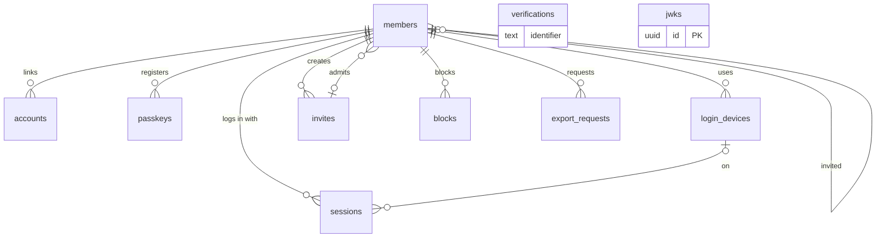
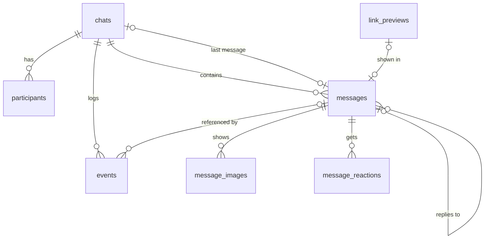
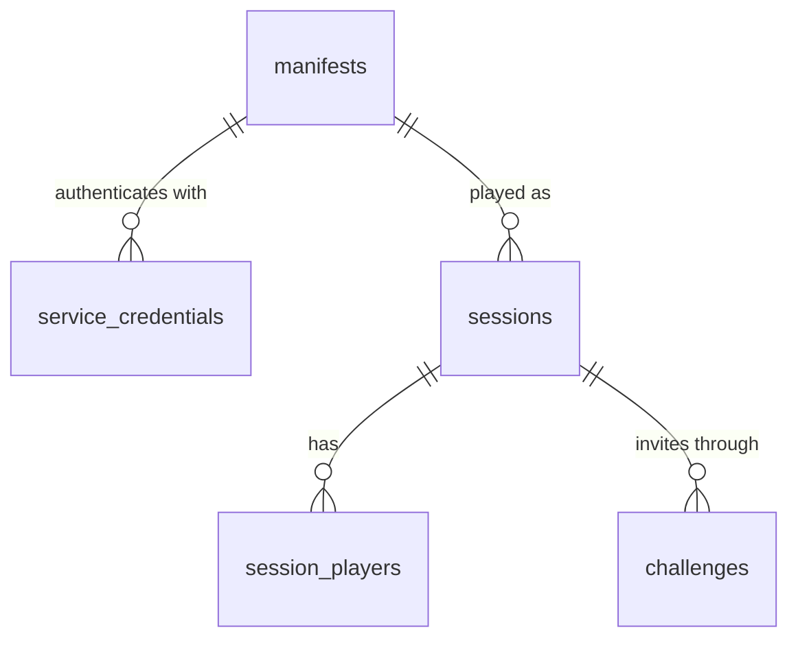
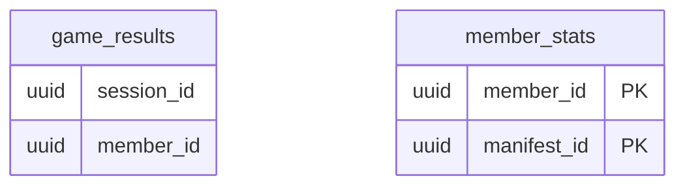
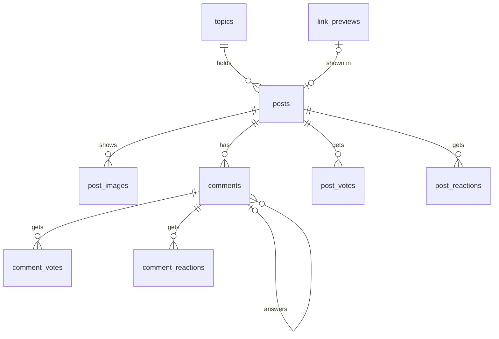
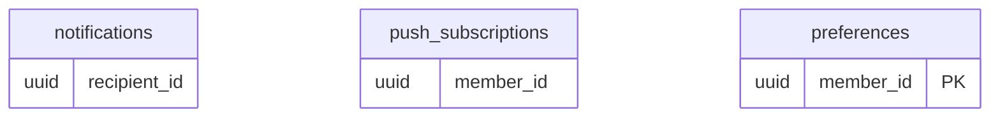
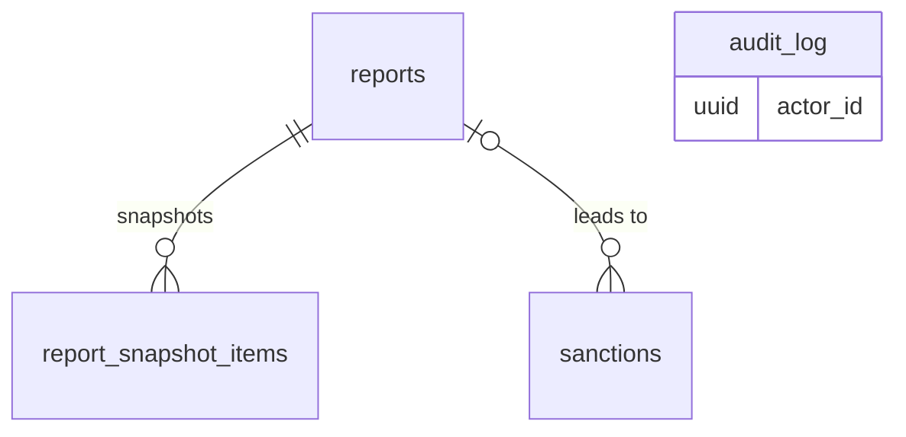
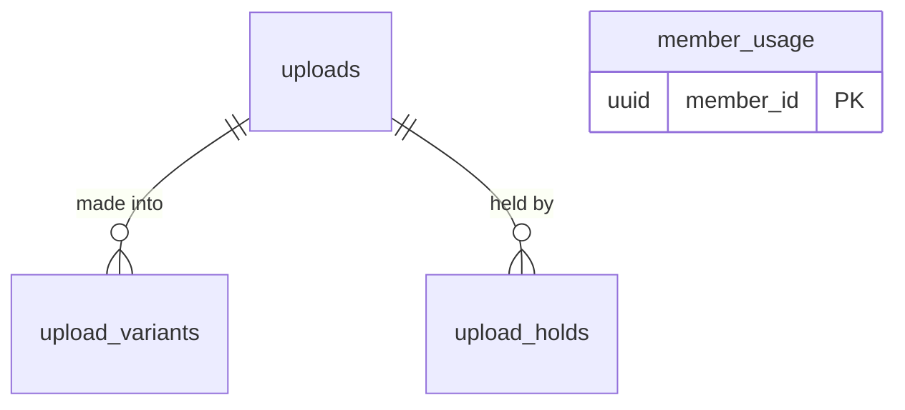

# Data model

Status: **accepted** (CHK-15, reviewed 2026-10-03). The [review decisions](#review-decisions) at the end record what was settled (D57, D58, ADR-0014), and the [screen map decisions](#screen-map-decisions) what the screen map added (D60–D66). Where this doc and an ADR or spec decision disagree, the ADR or decision wins, and this doc is fixed.

This doc lists, for every module, its Postgres tables with their columns, keys, indexes and stored counters, and what each table does when a Member is erased. It follows the module data ownership rules in ADR-0007: one schema per module, references to other modules by ID only, counters stored with the item. A test, `packages/config/test/data-model.test.ts`, checks the doc against those rules.

## Conventions

**Schemas.** Each module owns one Postgres schema with the module's name: `identity`, `chat`, `games`, `results`, `feed`, `notifications`, `moderation`, `media` (ADR-0014). `search` and the sync check own no tables (ADR-0007, ADR-0012). Graphile Worker owns `graphile_worker` and migrates it itself; Drizzle's `schemaFilter` leaves it out. All module schemas share one Drizzle migration history (D36). The first migration creates the `pg_trgm` and `unaccent` extensions in `public`.

**Keys and IDs.**
- Every entity table has `id uuid` primary key with default `uuidv7()` (Postgres 18, ADR-0011), so IDs sort by creation time. Join tables (Participants, Votes, Reactions) use a composite primary key instead.
- Better Auth is set to `generateId: false` so the database default makes its IDs too.
- IDs from the client are never primary keys. Sending uses a separate `client_id` for idempotency (§5.3); System lines, which the server writes, have none (D60).

**References.** In the column tables below:
- `FK → schema.table.column` is a real foreign key. It always points into the same schema.
- `ID → schema.table.column` is a reference to another module's row by ID only: a plain `uuid`, no foreign key and no join (ADR-0003, ADR-0007). Callers read the other module through its batch functions (`identity.getProfiles(ids)` and so on), and must render a row that comes back missing.
- Rows that other modules point at are not hard-deleted while anything may still reference them. A Member becomes a tombstone row on erasure (see [identity](#identity)), and Messages, Posts and Comments become placeholders. So `ID →` references don't dangle in practice.

**Columns.**
- Names are `snake_case`. Tables are plural nouns.
- Times are `timestamptz`; a few calendar values are `date`.
- Columns are `not null` unless the type says `null`.
- Closed sets of values are `text` with a `check` constraint, not Postgres enums, because a check constraint is easier to change in a two-step migration (D36).
- Lengths from the spec are `check` constraints too, so the database enforces them as well as Zod.
- `jsonb` is used only for counters (`reaction_counts`) and for names in both UI languages (`names`). It never holds content.

**Index names.**
- `<table>_pkey` for the primary key
- `<table>_<what>_key` for unique indexes and constraints
- `<table>_<what>_idx` for other indexes
- `<table>_<what>_fkey` for composite foreign keys
- `<table>_<what>_check` for check constraints, listed with the table's keys and indexes

**Content and removal.**
- Message, Post and Comment rows stay when they are Deleted or Removed. Their content columns become `null` and `deleted_at` or `removed_at` is set. A `check` keeps them from both being set (CONTEXT.md: Deleted or Removed, never both).
- Only the latest text is kept after an edit (D5).
- Bodies are stored as the source text the composer produces. Mentions are encoded as Member IDs, in a token format defined in `packages/content` (D34). The parser turns the source into a tree when it is read (ADR-0011).

**What is never stored here.** Message and Comment bodies never appear outside their own table: not in `chat.events`, job payloads, Notifications or the audit log (D9, ADR-0008). The only copy is a Report snapshot, which Admins see. Typing, Presence, realtime tickets and rate-limit counters live in Redis.

## Entities

Every term defined in [CONTEXT.md](../../CONTEXT.md), and where it lives.

| Term | Stored in | Notes |
|---|---|---|
| Member | `identity.members` | Better Auth's `user` model, renamed |
| Admin | `identity.members.role` | `role = 'admin'` |
| Deleted user | `identity.members` | the tombstone row after erasure (`status = 'erased'`) |
| Invite | `identity.invites` | who used it is `identity.members.invite_id` |
| Username | `identity.members.username` | |
| Display Name | `identity.members.display_name` | |
| Profile Link | not stored | built from the Username (`/@username`) |
| Chat | `chat.chats` | |
| Direct Chat | `chat.chats` | `kind = 'direct'`, one per pair through `chats_direct_pair_key` |
| Group Chat | `chat.chats` | `kind = 'group'` |
| Participant | `chat.participants` | |
| Group Owner | `chat.participants.role` | `role = 'owner'`, exactly one per Group Chat |
| Group Admin | `chat.participants.role` | `role = 'admin'` |
| Message | `chat.messages` | |
| Message Reply | `chat.messages.reply_to_id` | same-Chat foreign key |
| System line | `chat.messages` | `kind = 'system'`, with `system_event` and `system_member_id` (D60) |
| Post Card | `chat.messages.post_card_post_id` | the Post is read from `feed` when shown |
| Link Preview | `chat.link_previews`, `feed.link_previews` | one per Message or Post, owned by the module whose item shows it (ADR-0014) |
| Unread | not stored | derived: Messages with `seq` above my `chat.participants.read_seq` that I didn't write, not counting System lines |
| Mute | `chat.participants.muted_until` | `infinity` means indefinitely |
| Read Position | `chat.participants.read_seq` | outside the Chat Sequence (D49) |
| Chat Sequence | `chat.chats.last_seq`, `chat.events` | each Message also keeps the `seq` it was created at |
| Presence | `identity.members.last_seen_on` | only the rough last seen, as a date (D58); online state is in Redis with a time-to-live (ADR-0009) |
| Notification | `notifications.notifications` | |
| Push | `notifications.push_subscriptions` | each Push is a job, not a row |
| Game | `games.manifests` | a Game exists for the app only through its Manifest |
| Game Manifest | `games.manifests` | |
| Game Catalog | `games.manifests` | rows with `status = 'listed'`; no table of its own |
| Game Session | `games.sessions` | players in `games.session_players` |
| Game Challenge | `games.challenges` | |
| Game Result | `results.game_results` | per-Member totals in `results.member_stats` |
| Mini Player | not stored | client state, kept in session storage (D31) |
| Reference Game | `games.manifests` | a seeded row like any other Game |
| Topic | `feed.topics` | |
| Post | `feed.posts` | |
| Comment | `feed.comments` | |
| Vote | `feed.post_votes`, `feed.comment_votes` | |
| Score | `feed.posts.score`, `feed.comments.score` | stored counter: likes minus dislikes |
| Reaction | `chat.message_reactions`, `feed.post_reactions`, `feed.comment_reactions` | counts in `reaction_counts` on the item |
| Block | `identity.blocks` | |
| Report | `moderation.reports` | snapshot in `moderation.report_snapshot_items` |
| Deleted | `chat.messages`, `feed.posts`, `feed.comments` | `deleted_at` set, content columns `null` |
| Removed | `chat.messages`, `feed.posts`, `feed.comments` | `removed_at` set, content columns `null` |

## `identity`

Members, login (Better Auth), Invites and Blocks. Better Auth's tables are renamed to plural `snake_case` with its `modelName` and `fields` options, and its extra columns are `additionalFields`.



#### `identity.members`

One row per Member, kept as a tombstone after erasure so every `ID → identity.members.id` stays valid.

| Column | Type | Notes |
|---|---|---|
| `id` | `uuid` | PK, default `uuidv7()` |
| `email` | `text` | lowercase, unique; Better Auth `email`. After erasure: `<id>@erased.invalid` (Better Auth requires a value; `.invalid` can never be delivered) |
| `email_verified` | `boolean` | Better Auth `emailVerified` |
| `display_name` | `text` | Better Auth `name`. 1–50 characters once signup is done; `''` until then and after erasure |
| `provider_image_url` | `text null` | Better Auth `image`, filled by Google. Never shown (CSP, D42); cleared on erasure |
| `username` | `text null` | `^[a-z0-9_]{3,20}$`, stored lowercase. `null` until chosen and after erasure, which frees it (D5) |
| `username_changed_at` | `timestamptz null` | at most once every 30 days (D12) |
| `avatar_upload_id` | `uuid null` | ID → `media.uploads.id`; public (D42) |
| `role` | `text` | `member` or `admin`, default `member`; Better Auth admin plugin `role` (D2 leaves room for `moderator`) |
| `banned` | `boolean` | default `false`; admin plugin `banned`, set only through `identity.setBan` called by `moderation` |
| `ban_reason` | `text null` | admin plugin `banReason`: a reason code, never free text |
| `ban_expires` | `timestamptz null` | admin plugin `banExpires`: the end of a suspension, `null` for a ban |
| `status` | `text` | `onboarding`, `active`, `deletion_requested`, `erased` |
| `deletion_requested_at` | `timestamptz null` | the 14-day grace period starts here (D5) |
| `invite_id` | `uuid null` | FK → `identity.invites.id`; the Invite used at signup. `null` only for seeded Admins |
| `invited_by_id` | `uuid null` | FK → `identity.members.id`; the invite tree (D12) |
| `invites_left` | `smallint` | default 5; ignored for Admins (D12). An unused Invite that expires or is cancelled gives one back, so 5 are open at a time (D58) |
| `age_confirmed_at` | `timestamptz null` | 16+ (D37) |
| `terms_accepted_at` | `timestamptz null` | |
| `terms_version` | `text null` | which terms and privacy policy were accepted |
| `locale` | `text null` | `en` or `uk`; `null` follows the browser (D18) |
| `share_read_receipts` | `boolean` | default `true` (D10) |
| `share_presence` | `boolean` | default `true` (D10) |
| `last_seen_on` | `date null` | the rough last seen (D10, D58): set from the sync check with `where last_seen_on is distinct from current_date`, so at most one write a day. The gateway never writes it (ADR-0009) |
| `created_at` | `timestamptz` | default `now()` |
| `updated_at` | `timestamptz` | Better Auth `updatedAt` |

Keys and indexes:
- `members_pkey`: primary key (`id`)
- `members_email_key`: unique (`email`)
- `members_username_key`: unique (`username`). Many `null`s are allowed, so erased Members don't collide.
- `members_username_trgm_idx`: GIN (`username gin_trgm_ops`): people search (D33)
- `members_display_name_trgm_idx`: GIN (`identity.unaccent_lower(display_name) gin_trgm_ops`): people search. `identity.unaccent_lower` is an `immutable` wrapper around `unaccent` and `lower`, because `unaccent` alone can't be used in an index.
- `members_invited_by_idx`: (`invited_by_id`): invite tree
- `members_email_check`: `email = lower(email)`
- `members_display_name_check`: at most 50 characters, and not `''` unless `status` is `onboarding` or `erased`
- `members_username_check`: `username ~ '^[a-z0-9_]{3,20}$'`
- `members_role_check`: `role in ('member', 'admin')`
- `members_status_check`: `status in ('onboarding', 'active', 'deletion_requested', 'erased')`
- `members_locale_check`: `locale in ('en', 'uk')`
- `members_invites_left_check`: `invites_left >= 0`

#### `identity.sessions`

Better Auth sessions, 30 days, extended while in use (D21).

| Column | Type | Notes |
|---|---|---|
| `id` | `uuid` | PK, default `uuidv7()` |
| `token` | `text` | unique; Better Auth `token` |
| `member_id` | `uuid` | FK → `identity.members.id`, on delete cascade; Better Auth `userId` |
| `expires_at` | `timestamptz` | |
| `ip_address` | `text null` | shown on the sessions page; deleted with the session |
| `user_agent` | `text null` | |
| `auth_method` | `text` | `google`, `email_code`, `email_link`, `passkey`. Admin tools need `passkey` (D47). Set in Better Auth's session hook |
| `login_device_id` | `uuid null` | FK → `identity.login_devices.id` |
| `impersonated_by` | `text null` | added by the admin plugin. Impersonation stays turned off: it would let an Admin read Chats (D2) |
| `created_at` | `timestamptz` | |
| `updated_at` | `timestamptz` | |

Keys and indexes:
- `sessions_pkey`: primary key (`id`)
- `sessions_token_key`: unique (`token`)
- `sessions_member_idx`: (`member_id`): sessions page, revoking all sessions on ban
- `sessions_expires_idx`: (`expires_at`): cleanup of expired sessions (ADR-0008)
- `sessions_auth_method_check`: `auth_method in ('google', 'email_code', 'email_link', 'passkey')`

#### `identity.accounts`

Better Auth login connections: one per Google account. Email codes and passkeys need no row here.

| Column | Type | Notes |
|---|---|---|
| `id` | `uuid` | PK, default `uuidv7()` |
| `member_id` | `uuid` | FK → `identity.members.id`, on delete cascade |
| `provider_id` | `text` | `google` |
| `account_id` | `text` | Google's subject ID |
| `access_token`, `refresh_token`, `id_token` | `text null` | written by Better Auth; we don't call Google APIs, so the auth ticket checks whether these can stay empty |
| `access_token_expires_at`, `refresh_token_expires_at` | `timestamptz null` | |
| `scope` | `text null` | |
| `password` | `text null` | always `null`: there are no passwords (ADR-0004) |
| `created_at` | `timestamptz` | |
| `updated_at` | `timestamptz` | |

Keys and indexes:
- `accounts_pkey`: primary key (`id`)
- `accounts_provider_account_key`: unique (`provider_id`, `account_id`)
- `accounts_member_idx`: (`member_id`)
- `accounts_password_check`: `password is null`

#### `identity.verifications`

Better Auth's short-lived values: email login codes (10 minutes, stored hashed, D32) and email change codes (D37).

| Column | Type | Notes |
|---|---|---|
| `id` | `uuid` | PK, default `uuidv7()` |
| `identifier` | `text` | the email address the code was sent to |
| `value` | `text` | the hashed code and attempt count |
| `expires_at` | `timestamptz` | |
| `created_at` | `timestamptz` | |
| `updated_at` | `timestamptz` | |

Keys and indexes:
- `verifications_pkey`: primary key (`id`)
- `verifications_identifier_idx`: (`identifier`)

#### `identity.passkeys`

`@better-auth/passkey`.

| Column | Type | Notes |
|---|---|---|
| `id` | `uuid` | PK, default `uuidv7()` |
| `member_id` | `uuid` | FK → `identity.members.id`, on delete cascade |
| `name` | `text null` | the Member's label for it |
| `public_key` | `text` | |
| `credential_id` | `text` | unique |
| `counter` | `bigint` | |
| `device_type` | `text` | |
| `backed_up` | `boolean` | |
| `transports` | `text null` | |
| `aaguid` | `text null` | |
| `created_at` | `timestamptz null` | |

Keys and indexes:
- `passkeys_pkey`: primary key (`id`)
- `passkeys_credential_key`: unique (`credential_id`)
- `passkeys_member_idx`: (`member_id`)

#### `identity.jwks`

Signing keys of the JWT plugin for Game identity tokens (ADR-0004). No Member data.

| Column | Type | Notes |
|---|---|---|
| `id` | `uuid` | PK, default `uuidv7()` |
| `public_key` | `text` | |
| `private_key` | `text` | encrypted by Better Auth with the app secret |
| `alg` | `text null` | |
| `crv` | `text null` | |
| `created_at` | `timestamptz` | |
| `expires_at` | `timestamptz null` | |

Keys and indexes:
- `jwks_pkey`: primary key (`id`)

#### `identity.login_devices`

Devices a Member has logged in from, for the new-device email alert (D21). The device is a long-lived random cookie; only its hash is stored.

| Column | Type | Notes |
|---|---|---|
| `id` | `uuid` | PK, default `uuidv7()` |
| `member_id` | `uuid` | FK → `identity.members.id`, on delete cascade |
| `device_hash` | `bytea` | SHA-256 of the device cookie |
| `label` | `text` | "Firefox on Windows", shown in the alert and on the sessions page |
| `first_seen_at` | `timestamptz` | |
| `last_seen_at` | `timestamptz` | |

Keys and indexes:
- `login_devices_pkey`: primary key (`id`)
- `login_devices_member_device_key`: unique (`member_id`, `device_hash`)

#### `identity.invites`

**Changing (D61):** the code in the Invite link is stored as `code text` (unique, replacing `code_hash`), so the Invites screen can copy a link again, and an optional `note text null` (1–50 characters, seen only by its creator, for example "For Sasha") is added. The migration and this table change ship together in CHK-21, because the `identity` schema test compares this table with the database. The code is 128 random bits, base64url.

| Column | Type | Notes |
|---|---|---|
| `id` | `uuid` | PK, default `uuidv7()` |
| `code_hash` | `bytea` | SHA-256 of the code in the Invite link; the code itself is never stored |
| `created_by_id` | `uuid` | FK → `identity.members.id` |
| `kind` | `text` | `single` or `multi` (multi-use only by Admins, D12) |
| `max_uses` | `integer` | 1 for `single` |
| `use_count` | `integer` | default 0; counter, raised in the signup transaction |
| `expires_at` | `timestamptz` | 7 days for Member Invites (D12) |
| `revoked_at` | `timestamptz null` | cancelled by the creator, or by a ban (D37) |
| `created_at` | `timestamptz` | |

Keys and indexes:
- `invites_pkey`: primary key (`id`)
- `invites_code_key`: unique (`code_hash`)
- `invites_created_by_idx`: (`created_by_id`): my Invites, cancelling a banned Member's unused Invites
- `invites_kind_check`: `kind in ('single', 'multi')`
- `invites_max_uses_check`: `max_uses >= 1`, and 1 for `single`
- `invites_use_count_check`: `use_count between 0 and max_uses`

#### `identity.blocks`

| Column | Type | Notes |
|---|---|---|
| `blocker_id` | `uuid` | FK → `identity.members.id` |
| `blocked_id` | `uuid` | FK → `identity.members.id` |
| `created_at` | `timestamptz` | |

Keys and indexes:
- `blocks_pkey`: primary key (`blocker_id`, `blocked_id`): my block list, and one direction of `getBlockRelations`
- `blocks_blocked_idx`: (`blocked_id`): the other direction. `identity.getBlockRelations(viewerId)` is one query over both indexes (ADR-0007).
- `blocks_self_check`: `blocker_id <> blocked_id`

#### `identity.export_requests`

Data export requests from Settings, delivered by an Admin within 30 days (D37).

| Column | Type | Notes |
|---|---|---|
| `id` | `uuid` | PK, default `uuidv7()` |
| `member_id` | `uuid` | FK → `identity.members.id` |
| `requested_at` | `timestamptz` | |
| `delivered_at` | `timestamptz null` | |

Keys and indexes:
- `export_requests_pkey`: primary key (`id`)
- `export_requests_open_idx`: (`requested_at`) where `delivered_at is null`: the Admins' to-do list

### Counters

`identity.invites.use_count`, `identity.members.invites_left`.

### Erasure

`identity` emits `member.erasure_requested` when the 14-day grace period ends (D5), in the same transaction as its own changes below. Every other module handles it as a job.

| Table | On `member.erasure_requested` |
|---|---|
| `identity.members` | kept as the tombstone: `status = 'erased'`, `email = '<id>@erased.invalid'`, `display_name = ''`, `username`, `avatar_upload_id`, `provider_image_url`, `locale` and the consent columns set to `null`, ban columns cleared. `invite_id` and `invited_by_id` stay, so the invite tree shows "Deleted user" |
| `identity.sessions` | deleted (and the gateway closes the sockets, ADR-0009) |
| `identity.accounts` | deleted |
| `identity.verifications` | rows for the Member's email deleted, before the email is overwritten |
| `identity.passkeys` | deleted |
| `identity.login_devices` | deleted |
| `identity.invites` | kept for the invite tree; unused ones get `revoked_at`; the `note` is set to `null` (D61) |
| `identity.blocks` | deleted in both directions |
| `identity.export_requests` | deleted |

## `chat`

Chats, Participants, Messages and everything that changes inside a Chat, with the Chat Sequence (ADR-0009, ADR-0012).



#### `chat.chats`

| Column | Type | Notes |
|---|---|---|
| `id` | `uuid` | PK, default `uuidv7()` |
| `kind` | `text` | `direct` or `group` |
| `direct_member_low_id` | `uuid null` | ID → `identity.members.id`: the smaller of the two Member IDs of a Direct Chat |
| `direct_member_high_id` | `uuid null` | ID → `identity.members.id`: the larger one. `check`: both set and `low < high` exactly when `kind = 'direct'` |
| `name` | `text null` | Group Chats only, 1–64 characters |
| `avatar_upload_id` | `uuid null` | ID → `media.uploads.id`; private (D42) |
| `created_by_id` | `uuid` | ID → `identity.members.id` |
| `created_at` | `timestamptz` | |
| `last_seq` | `bigint` | default 0. **The Chat Sequence:** raised by one, with `update … returning`, in every transaction that records an event. This row is the per-Chat lock (ADR-0009) |
| `last_message_id` | `uuid null` | FK → `chat.messages.id`: counter for the chat list |
| `last_message_seq` | `bigint` | default 0: the Chat is Unread when this is above my `read_seq` and the last Message isn't mine. System lines don't move it (D60) |
| `activity_at` | `timestamptz` | default `now()`: the newest Message's time, or `created_at`; the chat list order |
| `participant_count` | `smallint` | counter; `check (participant_count <= 50)` (D3) |

Keys and indexes:
- `chats_pkey`: primary key (`id`)
- `chats_direct_pair_key`: unique (`direct_member_low_id`, `direct_member_high_id`) where `kind = 'direct'`: one Direct Chat per pair (D3)

#### `chat.participants`

| Column | Type | Notes |
|---|---|---|
| `chat_id` | `uuid` | FK → `chat.chats.id` |
| `member_id` | `uuid` | ID → `identity.members.id` |
| `role` | `text` | `owner`, `admin` or `participant`; Direct Chats only `participant` |
| `joined_at` | `timestamptz` | "longest-serving" when ownership passes on (D3) |
| `added_by_id` | `uuid null` | ID → `identity.members.id` |
| `read_seq` | `bigint` | default 0. **The Read Position** (D49): only moves forward (`set read_seq = greatest(read_seq, $1)`) and takes no Chat Sequence number |
| `muted_until` | `timestamptz null` | Mute; `infinity` for indefinitely (D6) |
| `hidden_until_seq` | `bigint null` | "Hide chat", Direct Chats only (D66): the chat list skips the Chat while `chats.last_message_seq` is at most this, so a new Message brings it back. Opening the Chat clears it. Like the Read Position, it takes no Chat Sequence number and is published only to the Member's own sessions |

Leaving or being removed deletes the row; the `participant_left` or `participant_removed` event remains.

Keys and indexes:
- `participants_pkey`: primary key (`chat_id`, `member_id`): Read Positions for "Seen by" and catch-up
- `participants_member_idx`: (`member_id`) include (`chat_id`, `read_seq`): the chat list, and `chat.heads(memberId)` for the sync check, as one indexed query (ADR-0012)
- `participants_one_owner_key`: unique (`chat_id`) where `role = 'owner'`

#### `chat.messages`

| Column | Type | Notes |
|---|---|---|
| `id` | `uuid` | PK, default `uuidv7()` |
| `chat_id` | `uuid` | FK → `chat.chats.id` |
| `seq` | `bigint` | the Chat Sequence at which the Message was created: its order and the base of Unread counts |
| `kind` | `text` | `user` or `system`, default `user`. A System line (D60) records a change in a Group Chat |
| `system_event` | `text null` | System lines only: `chat_created`, `participant_added`, `participant_left`, `participant_removed`, `owner_changed`, `admin_added`, `admin_removed`, `chat_renamed`, `chat_avatar_changed` |
| `system_member_id` | `uuid null` | ID → `identity.members.id`: the Participant a System line is about (added, removed, new Owner); `author_id` is who made the change |
| `client_id` | `uuid null` | made by the sender's client; a retry with the same one returns the existing Message (§5.3). `null` only for System lines |
| `author_id` | `uuid` | ID → `identity.members.id`; stays after erasure and shows "Deleted user" |
| `body` | `text null` | source text, 1–4,000 characters (D58); `null` when Deleted or Removed, or when the Message has only images |
| `reply_to_id` | `uuid null` | the quoted Message (D26), through `messages_reply_fkey` |
| `post_card_post_id` | `uuid null` | ID → `feed.posts.id` (D4) |
| `link_preview_id` | `uuid null` | FK → `chat.link_previews.id`; `check`: not both a Post Card and a Link Preview |
| `reaction_counts` | `jsonb` | default `{}`: counter, emoji → count, updated in the Reaction's transaction (ADR-0007) |
| `created_at` | `timestamptz` | |
| `edited_at` | `timestamptz null` | the "edited" marker (D5) |
| `deleted_at` | `timestamptz null` | Deleted by the author (D5) |
| `removed_at` | `timestamptz null` | Removed by an Admin from a Report (D47); `check (deleted_at is null or removed_at is null)` |

Keys and indexes:
- `messages_pkey`: primary key (`id`)
- `messages_chat_seq_key`: unique (`chat_id`, `seq`): the Message window, paging up and down, jump to first unread, Unread counts
- `messages_chat_id_key`: unique (`chat_id`, `id`): target of `messages_reply_fkey`
- `messages_reply_fkey`: FK (`chat_id`, `reply_to_id`) → `chat.messages` (`chat_id`, `id`): a Message Reply always quotes a Message in the same Chat
- `messages_author_client_key`: unique (`author_id`, `client_id`): idempotent sends; also finds a Member's Messages on erasure
- `messages_kind_check`: `kind in ('user', 'system')`; for `system`, `system_event` is set and `client_id`, `body`, `reply_to_id`, `post_card_post_id` and `link_preview_id` are `null`; for `user`, `system_event` and `system_member_id` are `null` and `client_id` is set

A System line is written in the same transaction as the change it records and shares its Chat Sequence number: for example, the `participant_added` event's `message_id` points at the line. System lines take no Reactions, Message Replies, edits, deletes or Reports, and they never notify; being added still creates the `group_chat_added` Notification. They update `last_message_id` and `activity_at`, so the chat list shows "Anya added Sasha", but not `last_message_seq`. Direct Chats have none (D60).

#### `chat.message_images`

Up to 4 images per Message (D4), shown as placeholders until processed (D46).

| Column | Type | Notes |
|---|---|---|
| `message_id` | `uuid` | FK → `chat.messages.id`, on delete cascade |
| `position` | `smallint` | 0–3 |
| `upload_id` | `uuid` | ID → `media.uploads.id` |
| `width` | `smallint` | from the client for the placeholder, corrected after processing |
| `height` | `smallint` | |
| `ready` | `boolean` | default `false`; set by the `media.upload_processed` job, which also records a `message_images_ready` event |

Keys and indexes:
- `message_images_pkey`: primary key (`message_id`, `position`)
- `message_images_upload_key`: unique (`upload_id`)

#### `chat.message_reactions`

| Column | Type | Notes |
|---|---|---|
| `message_id` | `uuid` | FK → `chat.messages.id`, on delete cascade |
| `member_id` | `uuid` | ID → `identity.members.id` |
| `emoji` | `text` | one of the Reaction set in `packages/content` (D56); checked in code, since the set is config |
| `created_at` | `timestamptz` | |

Keys and indexes:
- `message_reactions_pkey`: primary key (`message_id`, `member_id`, `emoji`): each emoji once per Member (D14), and who reacted
- `message_reactions_member_idx`: (`member_id`): erasure

#### `chat.link_previews`

A Link Preview is fetched when the composer sees an outside link, before Send, so the sender can dismiss it (D4). Sending attaches it to the Message. Unattached ones are deleted after 24 hours, like uploads, and attached ones are deleted with their Message (D58).

| Column | Type | Notes |
|---|---|---|
| `id` | `uuid` | PK, default `uuidv7()` |
| `fetched_by_id` | `uuid` | ID → `identity.members.id` |
| `url` | `text` | the outside link as written |
| `status` | `text` | `pending`, `ready`, `failed` |
| `title` | `text null` | from the page, cut to 200 characters |
| `description` | `text null` | cut to 500 characters |
| `site_name` | `text null` | |
| `image_upload_id` | `uuid null` | ID → `media.uploads.id`; downloaded once and stored privately (D42) |
| `created_at` | `timestamptz` | |

Keys and indexes:
- `link_previews_pkey`: primary key (`id`)
- `link_previews_created_idx`: (`created_at`): cleanup of unattached ones

#### `chat.events`

The Chat event log (ADR-0009): one row for every Chat Sequence number, append-only, references only.

| Column | Type | Notes |
|---|---|---|
| `chat_id` | `uuid` | FK → `chat.chats.id` |
| `seq` | `bigint` | the Chat Sequence number; numbers in a Chat have no gaps |
| `type` | `text` | see the list below |
| `message_id` | `uuid null` | FK → `chat.messages.id`: the Message the event is about |
| `member_id` | `uuid null` | ID → `identity.members.id`: the Participant or reacting Member the event is about |
| `actor_id` | `uuid null` | ID → `identity.members.id`: who made the change, when it isn't `member_id` (an Owner removing someone) |
| `created_at` | `timestamptz` | |

Keys and indexes:
- `events_pkey`: primary key (`chat_id`, `seq`): catch-up after a number
- `events_created_brin_idx`: BRIN (`created_at`): pruning. The table is append-only, so a BRIN index is tiny.

Event types (the realtime protocol doc owns the final list and payloads): `message_created`, `message_edited`, `message_deleted`, `message_removed`, `message_images_ready`, `message_image_rejected`, `reaction_added`, `reaction_removed`, `participant_added`, `participant_left`, `participant_removed`, `participant_role_changed`, `chat_created`, `chat_renamed`, `chat_avatar_changed`, `member_erased`. Reaction events don't carry the emoji: catch-up returns the Message's current `reaction_counts` and the viewer's own Reactions.

There are typed ID columns and no `jsonb`, so content can't slip into the log.

**Retention.** A daily cron job deletes events older than **30 days** (D58). Because numbers have no gaps, catch-up knows the log was pruned when the oldest kept `seq` for the Chat is above `afterSeq + 1`. The client then reloads the Chat's recent window (ADR-0009). Read Positions are never in the log (D49).

### Writing in a Chat

Every change that takes a Chat Sequence number runs in one transaction:
1. `update chat.chats set last_seq = last_seq + 1, … where id = $chat returning last_seq`. This locks the row, so changes in one Chat are serialized (ADR-0009).
2. Write the change: insert or update the Message, Reaction or Participant, with `seq` where the row has one.
3. Insert the `chat.events` row with that `seq`.
4. Add the jobs (ADR-0008) and commit. Publishing to Redis follows the commit.

A new Message also sets `last_message_id`, `last_message_seq` and `activity_at` in step 1; a System line sets only `last_message_id` and `activity_at` (D60). Moving a Read Position only updates `chat.participants` (ADR-0012) and adds the `chat.read_position_moved` job (D62). Handing over ownership (D65) is two `participant_role_changed` events in one transaction (the new Owner, then the old one, who becomes a Group Admin), with one `owner_changed` System line sharing the first number.

### Counters

`chat.chats.last_seq`, `last_message_id`, `last_message_seq`, `activity_at` and `participant_count`; `chat.messages.reaction_counts`. Unread counts are not stored, because a stored count would mean up to 50 row updates per Message. They are counted from `messages_chat_seq_key`, capped at 100 (shown as "99+"): Messages with `seq` above `read_seq`, not by me, not System lines, not Deleted or Removed.

### Erasure

| Table | On `member.erasure_requested` |
|---|---|
| `chat.chats` | `created_by_id` and the Direct Chat pair kept (IDs only). One `member_erased` event in each Chat the Member wrote in or belonged to, so clients reload those Chats instead of catching up on thousands of edits |
| `chat.participants` | removed from Group Chats as if they had left, with ownership passing on (D3). Kept in Direct Chats, so the other person keeps the history; nobody can send to a Deleted user |
| `chat.messages` | their Messages become Deleted: `body`, `post_card_post_id` and `link_preview_id` set to `null`, `deleted_at` set. System lines they made or are about stay (IDs only) and show "Deleted user" |
| `chat.message_images` | rows of their Messages deleted (`media` deletes the files) |
| `chat.message_reactions` | deleted, and the `reaction_counts` of those Messages recounted |
| `chat.link_previews` | the Member's previews deleted |
| `chat.events` | kept: IDs only, and the Member row is a tombstone |

## `games`

Game Manifests, Game Sessions and Game Challenges (§5.4, D15, D43).



#### `games.manifests`

Registered by an Admin; the Reference Game is a seeded row.

| Column | Type | Notes |
|---|---|---|
| `id` | `uuid` | PK, default `uuidv7()` |
| `slug` | `text` | unique, `^[a-z0-9-]{2,40}$`, e.g. `four-in-a-row` |
| `names` | `jsonb` | `{"en": …, "uk": …}`; `en` required |
| `origin` | `text` | unique, e.g. `https://reference.chakugames.app`: the iframe origin and the identity token audience (ADR-0004) |
| `launch_path` | `text` | |
| `image_url` | `text` | on the Game's origin |
| `contract_version` | `text` | |
| `min_players` | `smallint` | `>= 1` (D15) |
| `max_players` | `smallint` | `>= min_players` |
| `aspect_ratio` | `text null` | e.g. `4:3` |
| `min_width` | `smallint null` | |
| `min_height` | `smallint null` | |
| `status` | `text` | `listed`, `hidden`, `retired` |
| `registered_by_id` | `uuid` | ID → `identity.members.id` |
| `created_at` | `timestamptz` | |
| `updated_at` | `timestamptz` | |

Keys and indexes:
- `manifests_pkey`: primary key (`id`)
- `manifests_slug_key`: unique (`slug`)
- `manifests_origin_key`: unique (`origin`)

#### `games.service_credentials`

Each Game server's secret for posting Game Results, rotatable (D31). During a rotation, the old and new credentials are both valid.

| Column | Type | Notes |
|---|---|---|
| `id` | `uuid` | PK, default `uuidv7()` |
| `manifest_id` | `uuid` | FK → `games.manifests.id` |
| `secret_hash` | `bytea` | the secret is shown once at registration, never stored |
| `created_at` | `timestamptz` | |
| `last_used_at` | `timestamptz null` | |
| `revoked_at` | `timestamptz null` | |

Keys and indexes:
- `service_credentials_pkey`: primary key (`id`)
- `service_credentials_active_idx`: (`manifest_id`) where `revoked_at is null`

#### `games.sessions`

| Column | Type | Notes |
|---|---|---|
| `id` | `uuid` | PK, default `uuidv7()` |
| `manifest_id` | `uuid` | FK → `games.manifests.id` |
| `status` | `text` | `waiting`, `active`, `finished`, `abandoned` (§5.4) |
| `created_by_id` | `uuid null` | ID → `identity.members.id`; `null` after erasure |
| `player_count` | `smallint` | counter |
| `created_at` | `timestamptz` | |
| `started_at` | `timestamptz null` | |
| `ended_at` | `timestamptz null` | finished or abandoned |
| `last_heartbeat_at` | `timestamptz` | the newest heartbeat from any player (D43) |

Keys and indexes:
- `sessions_pkey`: primary key (`id`)
- `sessions_open_heartbeat_idx`: (`last_heartbeat_at`) where `status in ('waiting', 'active')`: the timer job marks Sessions abandoned after 2 minutes without a heartbeat (D43)

Reporting a Game Result changes `status` to `finished` with `where status in ('waiting', 'active')`, so a Session is finalized at most once. The same transaction adds a `games.session_finished` job carrying the Session ID, Game ID and each player's outcome and score (no content), which `results` turns into Game Results.

#### `games.session_players`

| Column | Type | Notes |
|---|---|---|
| `session_id` | `uuid` | FK → `games.sessions.id` |
| `member_id` | `uuid` | ID → `identity.members.id` |
| `joined_at` | `timestamptz` | |
| `left_at` | `timestamptz null` | `requestLeave` (§5.4) |

Keys and indexes:
- `session_players_pkey`: primary key (`session_id`, `member_id`)
- `session_players_member_idx`: (`member_id`): a Member's open Sessions, erasure

#### `games.challenges`

| Column | Type | Notes |
|---|---|---|
| `id` | `uuid` | PK, default `uuidv7()` |
| `session_id` | `uuid` | FK → `games.sessions.id` |
| `from_member_id` | `uuid` | ID → `identity.members.id` |
| `to_member_id` | `uuid` | ID → `identity.members.id` |
| `status` | `text` | `pending`, `accepted`, `declined`, `expired`, `cancelled` |
| `created_at` | `timestamptz` | |
| `expires_at` | `timestamptz` | `created_at` + 15 minutes (D1) |
| `responded_at` | `timestamptz null` | |

Keys and indexes:
- `challenges_pkey`: primary key (`id`)
- `challenges_to_pending_idx`: (`to_member_id`, `created_at`) where `status = 'pending'`: pending Game Challenges in the sync check (ADR-0012)
- `challenges_pair_pending_key`: unique (`from_member_id`, `to_member_id`) where `status = 'pending'`: at most 1 pending Challenge per sender and invitee (D56, D58)
- `challenges_session_idx`: (`session_id`)

### Counters

`games.sessions.player_count`, `games.sessions.last_heartbeat_at`.

### Erasure

| Table | On `member.erasure_requested` |
|---|---|
| `games.manifests` | `registered_by_id` kept (an Admin's ID only) |
| `games.sessions` | `created_by_id` set to `null` |
| `games.session_players` | the Member's rows deleted; their open Sessions see `playersChanged` |
| `games.challenges` | deleted, sent and received |

## `results`

Game Results and per-Member stats (§5.2).



The two tables don't reference each other: `member_stats` is a counter table kept up to date in the same transaction as `game_results`.

#### `results.game_results`

One row per player per finished Game Session.

| Column | Type | Notes |
|---|---|---|
| `id` | `uuid` | PK, default `uuidv7()` |
| `session_id` | `uuid` | ID → `games.sessions.id` |
| `manifest_id` | `uuid` | ID → `games.manifests.id` |
| `member_id` | `uuid null` | ID → `identity.members.id`; `null` after erasure, so the result stays but is anonymous (D5) |
| `outcome` | `text null` | `win`, `lose`, `draw` (D15) |
| `score` | `bigint null` | `check (outcome is not null or score is not null)` |
| `reported_at` | `timestamptz` | |

Keys and indexes:
- `game_results_pkey`: primary key (`id`)
- `game_results_session_member_key`: unique (`session_id`, `member_id`): the `games.session_finished` handler inserts with `on conflict do nothing`, so it can run twice (ADR-0008)
- `game_results_member_idx`: (`member_id`, `manifest_id`, `reported_at`): a Member's results per Game

#### `results.member_stats`

| Column | Type | Notes |
|---|---|---|
| `member_id` | `uuid` | ID → `identity.members.id` |
| `manifest_id` | `uuid` | ID → `games.manifests.id` |
| `played` | `integer` | counters, raised only for result rows that were actually inserted |
| `wins` | `integer` | |
| `losses` | `integer` | |
| `draws` | `integer` | |
| `best_score` | `bigint null` | |
| `last_played_at` | `timestamptz` | |

Keys and indexes:
- `member_stats_pkey`: primary key (`member_id`, `manifest_id`)

### Erasure

| Table | On `member.erasure_requested` |
|---|---|
| `results.game_results` | `member_id` set to `null` |
| `results.member_stats` | deleted |

## `feed`

Topics, Posts, Comments, and Votes and Reactions on them (D13, D14, D33).



#### `feed.topics`

| Column | Type | Notes |
|---|---|---|
| `id` | `uuid` | PK, default `uuidv7()` |
| `slug` | `text` | unique, `^[a-z0-9-]{2,40}$`: `/t/[slug]` |
| `names` | `jsonb` | `{"en": "General", "uk": "Загальне"}`; `en` required |
| `is_default` | `boolean` | default `false` |
| `position` | `smallint` | order in the Topic list |
| `created_by_id` | `uuid` | ID → `identity.members.id` (an Admin) |
| `created_at` | `timestamptz` | |
| `archived_at` | `timestamptz null` | an archived Topic takes no new Posts |

Keys and indexes:
- `topics_pkey`: primary key (`id`)
- `topics_slug_key`: unique (`slug`)
- `topics_one_default_key`: unique (`is_default`) where `is_default`: exactly one General

#### `feed.posts`

| Column | Type | Notes |
|---|---|---|
| `id` | `uuid` | PK, default `uuidv7()` |
| `topic_id` | `uuid` | FK → `feed.topics.id` |
| `author_id` | `uuid` | ID → `identity.members.id` |
| `title` | `text null` | 1–120 characters (D13); `null` only when Deleted or Removed |
| `subtitle` | `text null` | up to 200 |
| `body` | `text null` | up to 10,000 |
| `slug` | `text` | from the title, for `/posts/[id]-slug`; the ID decides, a wrong slug redirects |
| `link_preview_id` | `uuid null` | FK → `feed.link_previews.id` |
| `likes` | `integer` | default 0, counter |
| `dislikes` | `integer` | default 0, counter |
| `score` | `integer` | generated, stored: `likes - dislikes` (D13) |
| `hot_rank` | `double precision` | generated, stored: `feed.hot_rank(likes, dislikes, created_at)`, see [Ranking](#ranking) |
| `reaction_counts` | `jsonb` | default `{}`, counter |
| `comment_count` | `integer` | default 0, counter, not counting Deleted or Removed Comments |
| `search_vector` | `tsvector` | generated, stored: title (weight A), subtitle (B) and body (C) through `to_tsvector('simple', feed.unaccent_lower(…))` (D33) |
| `created_at` | `timestamptz` | |
| `edited_at` | `timestamptz null` | |
| `deleted_at` | `timestamptz null` | |
| `removed_at` | `timestamptz null` | `check (deleted_at is null or removed_at is null)` |

Deleted and Removed Posts leave every feed list (the partial indexes below skip them). The Post page still shows the placeholder with its Comments.

Keys and indexes (all list indexes are partial: `where deleted_at is null and removed_at is null`):
- `posts_pkey`: primary key (`id`)
- `posts_hot_idx`: (`hot_rank desc`, `id desc`): Hot, all Topics
- `posts_topic_hot_idx`: (`topic_id`, `hot_rank desc`, `id desc`): Hot in a Topic
- `posts_new_idx`: (`created_at desc`, `id desc`): New, and the window for Top today and this week
- `posts_topic_new_idx`: (`topic_id`, `created_at desc`, `id desc`): New in a Topic
- `posts_top_idx`: (`score desc`, `id desc`): Top of all time
- `posts_topic_top_idx`: (`topic_id`, `score desc`, `id desc`): Top of all time in a Topic
- `posts_search_idx`: GIN (`search_vector`): Post search, optionally filtered by Topic (D17)
- `posts_author_created_idx`: (`author_id`, `created_at desc`, `id desc`): a Member's Posts on their profile, newest first (D64), and erasure. Not partial, so erasure finds Deleted Posts too; the profile query skips them

#### `feed.post_images`

| Column | Type | Notes |
|---|---|---|
| `post_id` | `uuid` | FK → `feed.posts.id`, on delete cascade |
| `position` | `smallint` | 0–9 (D13); position 0 is the feed card image and the link preview image |
| `upload_id` | `uuid` | ID → `media.uploads.id`; public (D42) |
| `width` | `smallint` | |
| `height` | `smallint` | |
| `alt_text` | `text null` | up to 1,000 characters |

Keys and indexes:
- `post_images_pkey`: primary key (`post_id`, `position`)
- `post_images_upload_key`: unique (`upload_id`)

#### `feed.link_previews`

The same shape as `chat.link_previews`: one per Post, for the first outside link in its body (D13, ADR-0014). Deleted with its Post (D58).

| Column | Type | Notes |
|---|---|---|
| `id` | `uuid` | PK, default `uuidv7()` |
| `fetched_by_id` | `uuid` | ID → `identity.members.id` |
| `url` | `text` | |
| `status` | `text` | `pending`, `ready`, `failed` |
| `title` | `text null` | |
| `description` | `text null` | |
| `site_name` | `text null` | |
| `image_upload_id` | `uuid null` | ID → `media.uploads.id` |
| `created_at` | `timestamptz` | |

Keys and indexes:
- `link_previews_pkey`: primary key (`id`)
- `link_previews_created_idx`: (`created_at`): cleanup of unattached ones

#### `feed.comments`

| Column | Type | Notes |
|---|---|---|
| `id` | `uuid` | PK, default `uuidv7()` |
| `post_id` | `uuid` | FK → `feed.posts.id` |
| `parent_id` | `uuid null` | the Comment it answers, through `comments_parent_fkey`; `null` for a top-level Comment |
| `root_id` | `uuid null` | FK → `feed.comments.id`: the top-level Comment of its thread; `null` for a top-level Comment |
| `depth` | `smallint` | 0 for top-level. The UI shows 4–5 levels, then "continue thread"; the data has no limit |
| `author_id` | `uuid` | ID → `identity.members.id` |
| `body` | `text null` | 1–5,000 characters (D58); `null` when Deleted or Removed |
| `likes` | `integer` | default 0, counter |
| `dislikes` | `integer` | default 0, counter |
| `score` | `integer` | generated, stored: `likes - dislikes` |
| `best_rank` | `double precision` | generated, stored: `feed.wilson_lower_bound(likes, dislikes)`, see [Ranking](#ranking) |
| `reaction_counts` | `jsonb` | default `{}`, counter |
| `reply_count` | `integer` | default 0, counter: direct answers, for collapsed threads |
| `created_at` | `timestamptz` | |
| `edited_at` | `timestamptz null` | |
| `deleted_at` | `timestamptz null` | a Deleted Comment stays as "[deleted]" so its answers keep their place |
| `removed_at` | `timestamptz null` | `check (deleted_at is null or removed_at is null)` |

Keys and indexes:
- `comments_pkey`: primary key (`id`)
- `comments_post_id_key`: unique (`post_id`, `id`): target of `comments_parent_fkey`
- `comments_parent_fkey`: FK (`post_id`, `parent_id`) → `feed.comments` (`post_id`, `id`): an answer is always under the same Post
- `comments_post_best_idx`: (`post_id`, `best_rank desc`, `created_at`, `id`) where `parent_id is null`: top-level Comments, Best first
- `comments_post_new_idx`: (`post_id`, `created_at desc`, `id desc`) where `parent_id is null`: top-level Comments, newest first
- `comments_root_idx`: (`root_id`): every answer under a page of top-level Comments, in one query; the server sorts each level by `best_rank` (or newest)
- `comments_author_idx`: (`author_id`): erasure

#### `feed.post_votes`

| Column | Type | Notes |
|---|---|---|
| `post_id` | `uuid` | FK → `feed.posts.id`, on delete cascade |
| `member_id` | `uuid` | ID → `identity.members.id` |
| `value` | `smallint` | `1` like, `-1` dislike; removing a Vote deletes the row |
| `created_at` | `timestamptz` | |
| `updated_at` | `timestamptz` | |

Keys and indexes:
- `post_votes_pkey`: primary key (`post_id`, `member_id`): one Vote per Member per Post
- `post_votes_member_idx`: (`member_id`): erasure

#### `feed.comment_votes`

| Column | Type | Notes |
|---|---|---|
| `comment_id` | `uuid` | FK → `feed.comments.id`, on delete cascade |
| `member_id` | `uuid` | ID → `identity.members.id` |
| `value` | `smallint` | `1` or `-1` |
| `created_at` | `timestamptz` | |
| `updated_at` | `timestamptz` | |

Keys and indexes:
- `comment_votes_pkey`: primary key (`comment_id`, `member_id`)
- `comment_votes_member_idx`: (`member_id`): erasure

#### `feed.post_reactions`

| Column | Type | Notes |
|---|---|---|
| `post_id` | `uuid` | FK → `feed.posts.id`, on delete cascade |
| `member_id` | `uuid` | ID → `identity.members.id` |
| `emoji` | `text` | from the Reaction set |
| `created_at` | `timestamptz` | |

Keys and indexes:
- `post_reactions_pkey`: primary key (`post_id`, `member_id`, `emoji`)
- `post_reactions_member_idx`: (`member_id`): erasure

#### `feed.comment_reactions`

| Column | Type | Notes |
|---|---|---|
| `comment_id` | `uuid` | FK → `feed.comments.id`, on delete cascade |
| `member_id` | `uuid` | ID → `identity.members.id` |
| `emoji` | `text` | from the Reaction set |
| `created_at` | `timestamptz` | |

Keys and indexes:
- `comment_reactions_pkey`: primary key (`comment_id`, `member_id`, `emoji`)
- `comment_reactions_member_idx`: (`member_id`): erasure

### Counters

On `feed.posts`: `likes`, `dislikes` (and the generated `score` and `hot_rank`), `reaction_counts`, `comment_count`. On `feed.comments`: `likes`, `dislikes` (and `score`, `best_rank`), `reaction_counts`, `reply_count`. Each is updated in the same transaction as the Vote, Reaction or Comment (ADR-0007), so Hot, Top and Best need no other module.

### Erasure

| Table | On `member.erasure_requested` |
|---|---|
| `feed.topics` | `created_by_id` kept (an Admin's ID only) |
| `feed.posts` | their Posts become Deleted: `title`, `subtitle`, `body` and `link_preview_id` set to `null`, `deleted_at` set |
| `feed.post_images` | rows of their Posts deleted (`media` deletes the files) |
| `feed.link_previews` | the Member's previews deleted |
| `feed.comments` | their Comments become Deleted: `body` set to `null`, `deleted_at` set; `comment_count` of the Posts lowered |
| `feed.post_votes` | deleted, and `likes`/`dislikes` of those Posts recounted |
| `feed.comment_votes` | deleted, and those Comments recounted |
| `feed.post_reactions` | deleted, and `reaction_counts` recounted |
| `feed.comment_reactions` | deleted, and `reaction_counts` recounted |

## `notifications`

The bell list, Push subscriptions and delivery settings (D6).



The three tables are all keyed by Member and don't reference each other.

#### `notifications.notifications`

| Column | Type | Notes |
|---|---|---|
| `id` | `uuid` | PK, default `uuidv7()` |
| `recipient_id` | `uuid` | ID → `identity.members.id` |
| `type` | `text` | `message_mention`, `message_reply`, `group_chat_added`, `game_challenge`, `post_comment`, `comment_reply`, `post_mention`, `comment_mention` (D6, D26), `content_removed`, `report_resolved` (D63) |
| `actor_id` | `uuid null` | ID → `identity.members.id`: who caused it |
| `subject_id` | `uuid` | the Message, Comment, Game Challenge, Post, Chat or Report it is about, by `type`; no content (D9). The reason and outcome of `content_removed` and `report_resolved` are read from `moderation` when the list is shown |
| `context_id` | `uuid null` | the Chat or Post to open |
| `context_seq` | `bigint null` | `message_mention` and `message_reply` only: the Message's Chat Sequence number, so reading the Chat up to it marks the Notification read (D62) |
| `created_at` | `timestamptz` | |
| `read_at` | `timestamptz null` | |

Keys and indexes:
- `notifications_pkey`: primary key (`id`)
- `notifications_recipient_idx`: (`recipient_id`, `created_at desc`, `id desc`): the bell list, and the newest Notification ID for the sync check
- `notifications_unread_idx`: (`recipient_id`) where `read_at is null`: the unread count for the sync check (ADR-0012)
- `notifications_subject_key`: unique (`recipient_id`, `type`, `subject_id`): editing a Message to add the same mention again doesn't notify twice
- `notifications_context_unread_idx`: (`recipient_id`, `context_id`, `context_seq`) where `read_at is null`: marking a Chat's Notifications read, and the "@" badge in the chat list (D62)
- `notifications_actor_idx`: (`actor_id`): erasure
- `notifications_created_brin_idx`: BRIN (`created_at`): retention cleanup

#### `notifications.push_subscriptions`

| Column | Type | Notes |
|---|---|---|
| `id` | `uuid` | PK, default `uuidv7()` |
| `member_id` | `uuid` | ID → `identity.members.id` |
| `session_id` | `uuid null` | ID → `identity.sessions.id`: logging out on that device deletes the subscription (a job from `identity`) |
| `endpoint` | `text` | unique |
| `p256dh` | `text` | the browser's key for web push encryption (D9) |
| `auth` | `text` | |
| `created_at` | `timestamptz` | |
| `last_success_at` | `timestamptz null` | |

Keys and indexes:
- `push_subscriptions_pkey`: primary key (`id`)
- `push_subscriptions_endpoint_key`: unique (`endpoint`)
- `push_subscriptions_member_idx`: (`member_id`)

#### `notifications.preferences`

| Column | Type | Notes |
|---|---|---|
| `member_id` | `uuid` | PK; ID → `identity.members.id` |
| `push_paused` | `boolean` | default `false`: the global switch (D6) |
| `show_message_text` | `boolean` | "Show message text in notifications" (D9); default `false` (D58) |
| `updated_at` | `timestamptz` | |

Keys and indexes:
- `preferences_pkey`: primary key (`member_id`)

**Read with the Chat (D62).** When a Read Position moves forward, `chat` adds a `chat.read_position_moved` job (Chat, Member, new `read_seq`) in the same transaction, with a Graphile job key per Member and Chat so a burst of moves leaves one pending job. `notifications` sets `read_at` on that Member's unread Notifications with that `context_id` and a `context_seq` up to the new `read_seq`. The chat list asks `notifications.unreadMentionChats(memberId)` once for the "@" badge (ADR-0007).

Mute is a Participant setting, so it lives in `chat.participants`. A Message job from `chat` carries the IDs of the Participants to alert, with Mute and Blocks already applied, and `notifications` only checks for an active tab (D29).

### Erasure

| Table | On `member.erasure_requested` |
|---|---|
| `notifications.notifications` | deleted where the Member is `recipient_id` or `actor_id` (what the actor wrote is now "[deleted]") |
| `notifications.push_subscriptions` | deleted |
| `notifications.preferences` | deleted |

## `moderation`

Reports, their snapshots, bans and suspensions, and the Admin audit log (D2, D9, D37, D47).



#### `moderation.reports`

| Column | Type | Notes |
|---|---|---|
| `id` | `uuid` | PK, default `uuidv7()` |
| `target_kind` | `text` | `message`, `post`, `comment`, `member` |
| `target_id` | `uuid` | the reported Message, Post, Comment or Member, by `target_kind` |
| `target_member_id` | `uuid null` | ID → `identity.members.id`: the author or reported person, for repeat abuse |
| `chat_id` | `uuid null` | ID → `chat.chats.id`: for a Message |
| `post_id` | `uuid null` | ID → `feed.posts.id`: for a Comment |
| `reporter_id` | `uuid null` | ID → `identity.members.id`; `null` for a logged-out visitor |
| `reporter_email` | `text null` | logged-out visitors only (D37); `check`: exactly one of `reporter_id` and `reporter_email`. Gets a transactional email when the Report is received and when it is resolved (D63); cleared with the snapshot, 90 days after resolution |
| `reason` | `text` | `spam`, `harassment`, `hate`, `sexual`, `violence`, `self_harm`, `illegal`, `other` |
| `details` | `text null` | up to 1,000 characters; never logged (D9) |
| `status` | `text` | `open`, `resolved`, `dismissed` |
| `resolution` | `text null` | `content_removed`, `member_suspended`, `member_banned`, `no_action` |
| `resolved_by_id` | `uuid null` | ID → `identity.members.id` |
| `resolved_at` | `timestamptz null` | |
| `snapshot_deleted_at` | `timestamptz null` | set by the cleanup 90 days after `resolved_at` (D9) |
| `created_at` | `timestamptz` | |

Keys and indexes:
- `reports_pkey`: primary key (`id`)
- `reports_queue_idx`: (`status`, `created_at`): the Admins' report queue
- `reports_target_member_idx`: (`target_member_id`): earlier Reports about the same person
- `reports_reporter_open_key`: unique (`reporter_id`, `target_kind`, `target_id`) where `status = 'open'` and `reporter_id is not null`: one open Report per Member per target
- `reports_snapshot_cleanup_idx`: (`resolved_at`) where `snapshot_deleted_at is null`

#### `moderation.report_snapshot_items`

The copy taken when the Report is made: for a Message, the Message and about 10 before it (D2); for a Post or Comment, its text at that moment; for a Member, their Username and Display Name. Admins only, every view in the audit log (D9).

| Column | Type | Notes |
|---|---|---|
| `report_id` | `uuid` | FK → `moderation.reports.id`, on delete cascade |
| `position` | `smallint` | order in the snapshot |
| `item_kind` | `text` | `message`, `post`, `comment`, `profile` |
| `item_id` | `uuid` | the Message, Post, Comment or Member it was copied from |
| `author_id` | `uuid null` | ID → `identity.members.id` |
| `body` | `text null` | the copied text |
| `image_upload_ids` | `uuid[]` | default `{}`: images in the copied item, kept through `media.upload_holds` until the snapshot is deleted (D58) |
| `item_created_at` | `timestamptz` | |

Keys and indexes:
- `report_snapshot_items_pkey`: primary key (`report_id`, `position`)
- `report_snapshot_items_author_idx`: (`author_id`): erasure

#### `moderation.sanctions`

Bans and suspensions, with their history (D37, D47). The state in force is copied to `identity.members` (`banned`, `ban_expires`) through `identity.setBan`, because `identity` enforces it at login.

| Column | Type | Notes |
|---|---|---|
| `id` | `uuid` | PK, default `uuidv7()` |
| `member_id` | `uuid` | ID → `identity.members.id` |
| `kind` | `text` | `ban` or `suspension` |
| `reason` | `text` | a reason code, as in `reports.reason` |
| `report_id` | `uuid null` | FK → `moderation.reports.id` |
| `created_by_id` | `uuid` | ID → `identity.members.id` |
| `created_at` | `timestamptz` | |
| `ends_at` | `timestamptz null` | suspensions only |
| `lifted_at` | `timestamptz null` | |
| `lifted_by_id` | `uuid null` | ID → `identity.members.id` |

Keys and indexes:
- `sanctions_pkey`: primary key (`id`)
- `sanctions_member_idx`: (`member_id`, `created_at`)

#### `moderation.audit_log`

Every Admin action: removal, ban, suspension, Invite change, snapshot view, Topic change, Game registration (D47). Kept 2 years. Actions in other modules reach it as an `admin_action.recorded` job added in that module's transaction, so no action is saved without its entry (ADR-0008).

| Column | Type | Notes |
|---|---|---|
| `id` | `uuid` | PK, default `uuidv7()` |
| `actor_id` | `uuid` | ID → `identity.members.id` |
| `action` | `text` | e.g. `message_removed`, `member_banned`, `snapshot_viewed`, `topic_updated`, `invite_created` |
| `target_kind` | `text` | `message`, `post`, `comment`, `member`, `invite`, `topic`, `report`, `game` |
| `target_id` | `uuid null` | |
| `report_id` | `uuid null` | the Report it came from. A plain ID with no FK, so the entry outlives the Report |
| `reason` | `text null` | a reason code from the `reports.reason` list; required for removals, bans and suspensions, with or without a Report. It is the reason in the notice to the author (D63) |
| `created_at` | `timestamptz` | |

There is no free-text or `jsonb` column, so no content can reach the log. Removals, bans and suspensions also add the notice jobs (D63): a `content_removed` Notification to the author; a `report_resolved` Notification to each reporting Member, or an email to a logged-out reporter; and a transactional email with the reason to a banned or suspended Member, whose sessions are closed.

Keys and indexes:
- `audit_log_pkey`: primary key (`id`)
- `audit_log_created_idx`: (`created_at desc`): the Admins' log view and the 2-year cleanup
- `audit_log_target_idx`: (`target_kind`, `target_id`): the history of one item or Member
- `audit_log_reason_check`: `reason` is `null` or one of the `reports.reason` codes, and is set for removals, bans and suspensions

### Erasure

| Table | On `member.erasure_requested` |
|---|---|
| `moderation.reports` | Reports the Member made: `details` set to `null`, `reporter_id` kept (ID only). Reports about them are kept |
| `moderation.report_snapshot_items` | kept until the snapshot's own deletion, 90 days after the Report is resolved, even when its author is erased (D58) |
| `moderation.sanctions` | kept (IDs only) |
| `moderation.audit_log` | kept (IDs only) |

## `media`

Uploads and the image sizes made from them, for every module (D42, D46, ADR-0014). Uploads exist before the Message or Post they end up in, the storage quota counts all of a Member's images, and the 24-hour cleanup spans every kind. All three are simpler with one owner.

Owning modules attach an upload when they save the item (`media.attach(uploadId, kind, targetId)`). The `/media/{id}/{size}` route in `apps/web` reads the upload from `media`, then asks the module that owns its target whether the viewer may see it (`canView`, D9), and redirects.

When an item is Deleted, Removed or erased, its module calls `media.delete(uploadIds)`. That sets `deletion_requested_at`, and a cleanup job deletes the rows and objects that no Report snapshot holds (D58).



#### `media.uploads`

| Column | Type | Notes |
|---|---|---|
| `id` | `uuid` | PK, default `uuidv7()`; the `{id}` in `/media/{id}/{size}` |
| `owner_id` | `uuid` | ID → `identity.members.id`: who uploaded it, or whose Message's Link Preview fetched it |
| `kind` | `text` | `message_image`, `post_image`, `member_avatar`, `group_chat_avatar`, `link_preview_image` |
| `visibility` | `text` | `private` or `public`, from `kind` (D9, D42) |
| `status` | `text` | `pending` (pre-signed link issued), `processing`, `ready`, `rejected` |
| `declared_type` | `text` | what the client said: JPEG, PNG, WebP, GIF or HEIC |
| `declared_bytes` | `integer` | up to 10 MB (D13) |
| `width` | `smallint` | from the client, then the real value |
| `height` | `smallint` | |
| `original_key` | `text` | random object key of the upload, deleted after processing |
| `rejection_reason` | `text null` | a code shown to the sender (D46) |
| `attached_to_id` | `uuid null` | the Message, Post, Member, Chat or Link Preview, by `kind` |
| `processed_bytes` | `bigint` | default 0: the sizes we keep, for the quota |
| `created_at` | `timestamptz` | |
| `processed_at` | `timestamptz null` | |
| `deletion_requested_at` | `timestamptz null` | its item is gone; deleted by the cleanup job once no hold remains |

Keys and indexes:
- `uploads_pkey`: primary key (`id`)
- `uploads_unattached_idx`: (`created_at`) where `attached_to_id is null`: the 24-hour cleanup (D46)
- `uploads_owner_idx`: (`owner_id`): erasure
- `uploads_deletion_idx`: (`deletion_requested_at`) where `deletion_requested_at is not null`: the deletion cleanup

When processing finishes, the job adds `media.upload_processed` (or `media.upload_rejected`) with the upload ID, kind and target, which the owning module handles: for example `chat` sets `message_images.ready` and records the `message_images_ready` event (D46).

#### `media.upload_variants`

| Column | Type | Notes |
|---|---|---|
| `upload_id` | `uuid` | FK → `media.uploads.id`, on delete cascade |
| `size` | `text` | the `{size}` in the link; names and pixel sizes are set in the images ticket |
| `object_key` | `text` | random, unguessable (D9) |
| `content_type` | `text` | |
| `width` | `smallint` | |
| `height` | `smallint` | |
| `bytes` | `integer` | |

Keys and indexes:
- `upload_variants_pkey`: primary key (`upload_id`, `size`)

#### `media.upload_holds`

Uploads a Report snapshot keeps after their item is gone (D58). `moderation` adds a hold when it takes the snapshot and releases it when the snapshot is deleted.

| Column | Type | Notes |
|---|---|---|
| `upload_id` | `uuid` | FK → `media.uploads.id`, on delete cascade |
| `holder_id` | `uuid` | the Report holding it; a plain ID, since `moderation` owns Reports |
| `created_at` | `timestamptz` | |

Keys and indexes:
- `upload_holds_pkey`: primary key (`upload_id`, `holder_id`)
- `upload_holds_holder_idx`: (`holder_id`): releasing a Report's holds

#### `media.member_usage`

| Column | Type | Notes |
|---|---|---|
| `member_id` | `uuid` | PK; ID → `identity.members.id` |
| `bytes` | `bigint` | counter: processed images, checked against the 1 GB quota (D56) before a pre-signed link is issued. Link Preview images don't count |

Keys and indexes:
- `member_usage_pkey`: primary key (`member_id`)

### Erasure

| Table | On `member.erasure_requested` |
|---|---|
| `media.uploads` | every upload the Member owns gets `deletion_requested_at`; the cleanup deletes rows and objects unless a Report snapshot holds them (D58) |
| `media.member_usage` | deleted |

## Ranking

The functions are SQL functions in `feed`, declared `immutable` so they can feed stored generated columns. Changing a constant is a migration: replace the function, then `alter table … alter column … set expression` to recompute every row (Postgres 17+).

**Hot** (D33), in the style of Reddit's hot ranking. With `s = likes - dislikes` and `t` the Post's `created_at` in seconds since `2026-01-01T00:00:00Z`:

```
hot = sign(s) * log10(max(|s|, 1)) + t / 45000
```

| Constant | Value | Meaning |
|---|---|---|
| epoch | `2026-01-01T00:00:00Z` | keeps the numbers small; it doesn't change the order |
| decay | 45,000 seconds (12.5 hours) | a Post needs 10 times the Score to rank level with a Post 12.5 hours newer |

`hot_rank` depends only on the Votes and `created_at`, so it changes only when someone votes. That is why it can be stored and indexed. Ties go to the newer Post (`id desc`).

**Top** is `score desc`. "Today" and "this week" are the last 24 hours and the last 7 days, not calendar days, so they need no time zone. They are read from `posts_new_idx` and sorted by Score; the window holds few Posts.

**Best** (D33): the lower bound of the Wilson score interval. With `n = likes + dislikes` and `p = likes / n`:

```
best = (p + z²/(2n) - z * sqrt(p(1 - p)/n + z²/(4n²))) / (1 + z²/n),   best = 0 when n = 0
```

`z = 1.281551565545` (80% confidence, as Reddit's "best"). Ties go to the older Comment (`created_at`), so a thread without Votes reads in order.

## List screens

Each list in the spec is one module's query on that module's indexes, with a fixed number of queries per page and never one per row (ADR-0007). Names and avatars come afterwards from one `identity.getProfiles(ids)` call, and Blocks from one `identity.getBlockRelations(viewerId)` call. Paging is by keyset (the last row's sort values), not offsets.

| Screen | Module | Query | Indexes |
|---|---|---|---|
| Chat list | chat | my `participants` rows joined to `chats` (same schema), ordered by `activity_at`, skipping hidden Direct Chats (D66); Unread from `last_message_seq` against `read_seq`; Unread counts capped at 100 in the same query | `participants_member_idx`, `chats_pkey`, `messages_chat_seq_key` |
| "@" badge in the chat list | notifications | Chats with unread `message_mention` Notifications (D62) | `notifications_context_unread_idx` |
| Sync check: latest Chat Sequence per Chat | chat | `chat.heads(memberId)` (ADR-0012) | `participants_member_idx`, `chats_pkey` |
| Message window and jump to first unread | chat | Messages by `seq` around a point, about 200 on the page (ADR-0011) | `messages_chat_seq_key` |
| Catch-up | chat | events after `afterSeq`, then the current state of what they reference, and every Participant's `read_seq` | `events_pkey`, `messages_pkey`, `participants_pkey` |
| Feed Hot | feed | visible Posts by `hot_rank`, all Topics or one | `posts_hot_idx`, `posts_topic_hot_idx` |
| Feed New | feed | visible Posts by `created_at` | `posts_new_idx`, `posts_topic_new_idx` |
| Feed Top | feed | all time: by `score`. Today and this week: the window from `posts_new_idx`, sorted by `score` | `posts_top_idx`, `posts_topic_top_idx`, `posts_new_idx`, `posts_topic_new_idx` |
| Comments Best | feed | a page of top-level Comments by `best_rank`, then all answers under them by `root_id`, sorted per level | `comments_post_best_idx`, `comments_root_idx` |
| Comments newest | feed | the same, by `created_at` | `comments_post_new_idx`, `comments_root_idx` |
| Post search | feed | `search_vector @@ query`, ranked by relevance then recency (D33) | `posts_search_idx` |
| Profile: Posts | feed | the Member's visible Posts, newest first (D64) | `posts_author_created_idx` |
| Profile: Game stats | results | `member_stats` rows of one Member (D64) | `member_stats_pkey` |
| People search | identity | trigram similarity on Username and Display Name (D33), Blocks applied | `members_username_trgm_idx`, `members_display_name_trgm_idx` |
| Block list | identity | my Blocks | `blocks_pkey` |
| Sessions page | identity | my sessions | `sessions_member_idx` |
| My Invites | identity | Invites I created | `invites_created_by_idx` |
| Invite tree | identity | Members invited by a Member, level by level | `members_invited_by_idx` |
| Bell list | notifications | my Notifications, newest first; the unread count | `notifications_recipient_idx`, `notifications_unread_idx` |
| Pending Game Challenges | games | Challenges to me with `status = 'pending'` | `challenges_to_pending_idx` |
| Game Catalog | games | Manifests with `status = 'listed'`; a handful of rows, no index needed | |
| Report queue | moderation | open Reports, oldest first | `reports_queue_idx` |
| Admin audit log | moderation | newest first | `audit_log_created_idx` |

## Review decisions

The questions this doc raised, as decided in review on 2026-10-03. Each is recorded in the spec (D57, D58) or ADR-0014, and the sections above follow it.

1. **A `media` module** owns uploads, image sizes, the storage quota and the cleanups (D57, ADR-0014).
2. **Hot constants:** decay of 45,000 seconds (12.5 hours) from the epoch 2026-01-01 (D58). Changing them later is one migration.
3. **Chat event log retention:** 30 days; catch-up further back reloads the Chat's window (D58). The realtime protocol doc sets the catch-up limits.
4. **Link Previews** belong to the module whose item shows them: `chat.link_previews` and `feed.link_previews`, with the fetching code shared (ADR-0014). They are deleted with their Message or Post (D58).
5. **Lengths:** Message up to 4,000 characters, Comment up to 5,000, Display Name 1–50, Group Chat name 1–64, image alt text up to 1,000, Report details up to 1,000 (D58).
6. **Game Challenges:** at most one pending Challenge per sender and invitee (D56, D58).
7. **"Show message text in notifications"** is off by default (D58).
8. **Last seen** is `identity.members.last_seen_on`, updated at most once a day from the sync check (D58).
9. **Report snapshots** keep their text and images until their deletion 90 days after resolution, even when the author is erased, through `media.upload_holds` (D58). The privacy policy says so (D53).
10. **Invites** that expire or are cancelled unused go back to the Member's count (D58).
11. **Better Auth's own columns** stay; impersonation stays off. The auth ticket (CHK-20) checks them against Better Auth 1.7, including the session hook that sets `auth_method` (D58).

### Screen map decisions

The gaps the [screen map](../design-system/screens.md) found, decided on 2026-10-03 (D60–D66, CHK-37). The sections above follow them.

1. **System lines** (D60): Group Chat changes are Messages of kind `system` in `chat.messages`, sharing the Chat Sequence number of the change they record. They don't count as Unread and don't move `last_message_seq`.
2. **Invite links** (D61): `identity.invites` stores the code and an optional note. The migration ships in CHK-21, together with the table change.
3. **Read with the Chat** (D62): `notifications.context_seq` and the `chat.read_position_moved` job mark mention and reply Notifications read when the Chat is read; the same index serves the "@" badge.
4. **Moderation notices** (D63): `content_removed` and `report_resolved` Notifications, emails to logged-out reporters and to banned or suspended Members, and `moderation.audit_log.reason`.
5. **Profile** (D64): Game stats from `results.member_stats`, and Posts through `posts_author_created_idx`, which replaces `posts_author_idx`.
6. **Handing over ownership** (D65): two `participant_role_changed` events and one `owner_changed` System line. No table change.
7. **Hide chat** (D66): `chat.participants.hidden_until_seq`, Direct Chats only.
