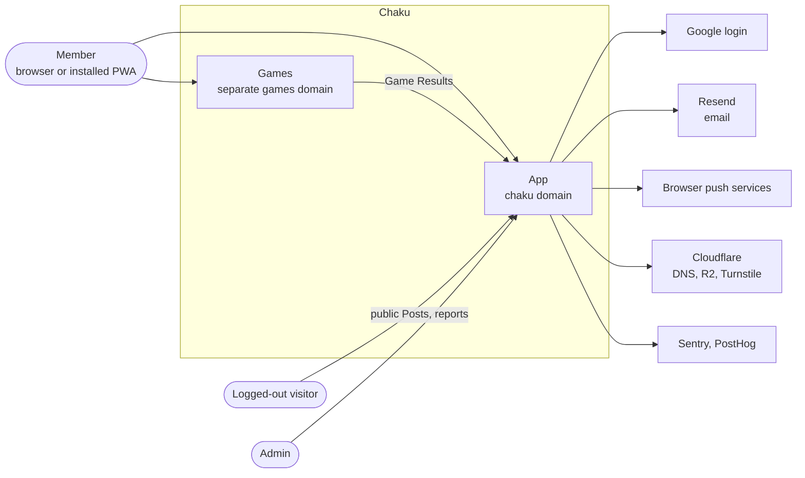
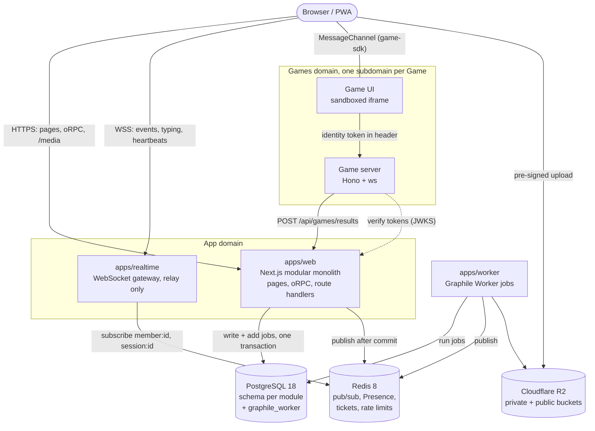
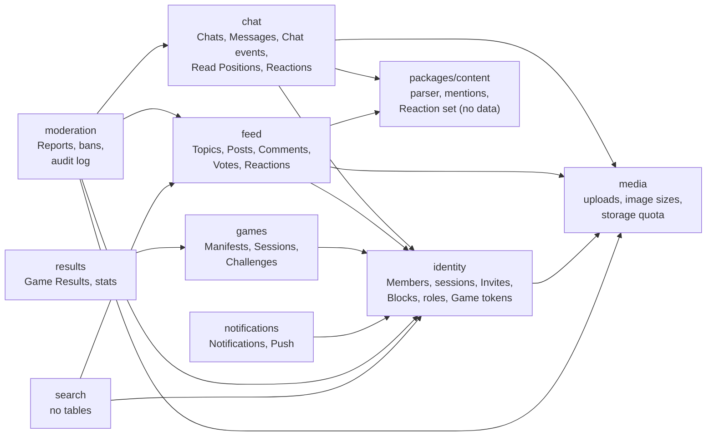
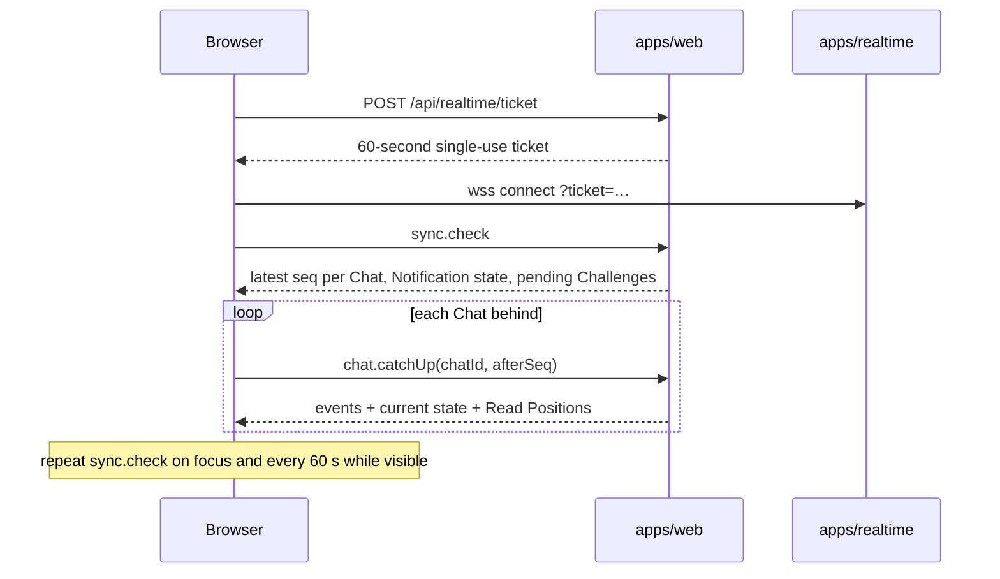

# Architecture overview

This page is the map. Each decision behind it is in an ADR or a spec decision (Dn), and those win if this page drifts.

## System context



## Containers

All on Railway in one EU region, built from our own Dockerfiles (ADR-0005). Local development runs the same set in Docker Compose behind Caddy on `.localhost` names (ADR-0006).



Rules that shape this picture:
- Writes go over HTTP into the owning module; the gateway never touches the database (ADR-0009).
- Jobs are added in the same transaction as the change; the job queue is the outbox (ADR-0008).
- Games are isolated: separate domain, sandboxed iframe, no cookies, results only from Game servers (ADR-0002).

## Modules

Each module is a package in `packages/modules/*` with one public entry point and its own Postgres schema (ADR-0003, ADR-0007, ADR-0014). Arrows are direct calls through the public entry point; side effects go through jobs instead.



Each module's tables, keys, indexes and counters, and how each handles erasure, are in the [data model](data-model.md).

`packages/db` holds the database plumbing every module and app shares: the `pg` pool and Drizzle client, the transaction helper that also hands over the `pg` client for adding jobs (ADR-0008), the one migration history for every module schema (D36) and the test harness (D19). It owns no tables and imports no module; each module declares its own tables in `src/schema.ts`.

### Jobs

Side effects and timers are Graphile Worker jobs (ADR-0008), run by `apps/worker`. `pnpm db:migrate` installs the `graphile_worker` schema with the module migrations, so apps can add jobs before the worker has ever run.

- **Define** a job in the module with `defineJob('<area>.<event>', z.object({ … }))` from `@chaku/db`. The payload holds IDs, enums, numbers, booleans and timestamps only (D9): `defineJob` throws on a field that could carry free text.
- **Add** it with `addJob(scope, job, payload, options)` inside `transaction(db, async (scope) => …)`, so the job exists if and only if the change commits. `jobKey` keeps one pending job for a burst of changes.
- **Handle** it with `handle(job, async (payload, { db, log, job, signal }) => …)` and export the module's `ModuleJobs` (`handlers`, and `cron` for scheduled jobs) from its public entry point. Add the module to [`apps/worker/src/modules.ts`](../../apps/worker/src/modules.ts). Only `apps/worker` imports `graphile-worker` (dependency-cruiser).
- **Idempotent:** a job can run more than once (a retry, a crash before it was marked done). Write so that a second run changes nothing: delete or update with a condition that the first run already made false (`where expires_at < now()`, `where status = 'pending'`), insert with `on conflict do nothing`, and for an outside effect such as an email, record that it was sent in the same transaction as the check. The worker checks the payload again before the handler runs.
- **Test** with `queuedJobs(db)` (the jobs a transaction added) and `runJob(db, moduleJobs, job, payload)` (the handler, run twice for idempotency) from `@chaku/db/testing`. Failing jobs are retried with backoff, up to 25 attempts by default; logs carry the job's name, ID and attempt, never its payload.

`apps/web` composes screens across modules with batch lookups (`identity.getProfiles`, `identity.getBlockRelations`) and composes the sync check from `chat`, `notifications` and `games` (ADR-0012). `packages/content` imports no module. Games import only `game-sdk` and `ui`.

## Key flows

How pages load data, and how realtime events, catch-up and the sync check keep the browser cache current: [web data flow](web-data-flow.md).

### Sending a Message

```mermaid
sequenceDiagram
  participant A as Sender browser
  participant W as apps/web (chat module)
  participant DB as Postgres
  participant R as Redis
  participant G as apps/realtime
  participant B as Recipient browser
  participant J as apps/worker

  A->>W: oRPC chat.send(clientId, chatId, text, uploadIds)
  W->>DB: BEGIN; bump Chat Sequence; insert Message + chat.events row; add jobs; COMMIT
  W->>R: publish to member:{id} of each Participant allowed to see it
  W-->>A: ok (seq)
  R->>G: event
  G->>B: event (seq)
  Note over B: gap in seq? run catch-up
  J->>DB: run jobs: Push if no active tab, Link Preview, image processing
```

`clientId` makes retries safe. Images are uploaded before Send and processed afterwards (D46).

### Reconnecting



### Opening a Game and challenging someone

```mermaid
sequenceDiagram
  participant H as App (Game shell)
  participant F as Game iframe
  participant S as Game server
  participant W as apps/web
  participant O as Other Member

  H->>W: games.openSession(gameId)
  W-->>H: Session + 10-minute identity token (audience = Game origin)
  H->>F: launch handshake, hand over MessagePort, init(token, session, players)
  F->>S: connect with token in header; server verifies via JWKS
  F->>H: requestInvite
  H->>H: app's own people picker
  H->>W: games.challenge(sessionId, memberIds)
  W-->>O: toast + Push + Notification
  O->>W: join
  loop every 30 s while open
    H->>W: session heartbeat (D43)
  end
  S->>W: POST /api/games/results (service credential)
```

## Environments

| | Local | PR preview | Production |
|---|---|---|---|
| How | `pnpm stack`, Docker Compose + Caddy | opt-in with the `preview` label (D51) | Railway, EU |
| Data | fixed seed | fresh database + seed | real |
| Email | Mailpit | its own Mailpit | Resend |
| Login | everything, plus dev switcher | email codes only | everything |
| Storage | SeaweedFS | R2 preview buckets | R2 |
