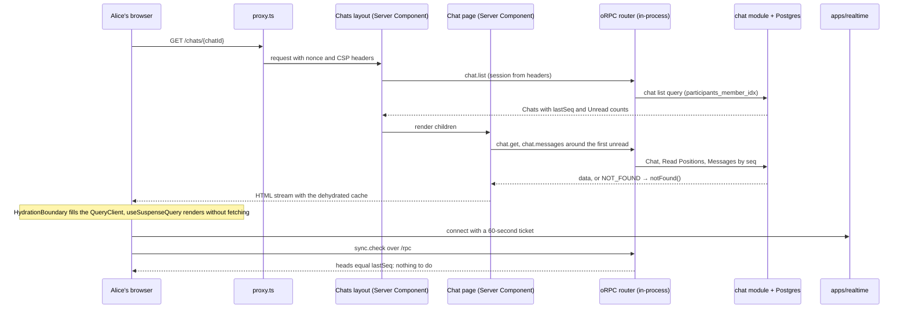
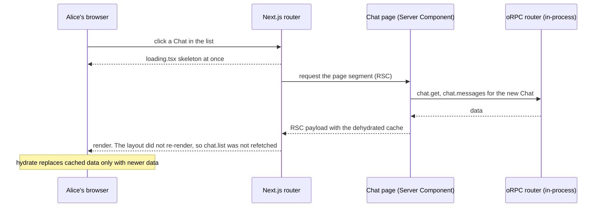
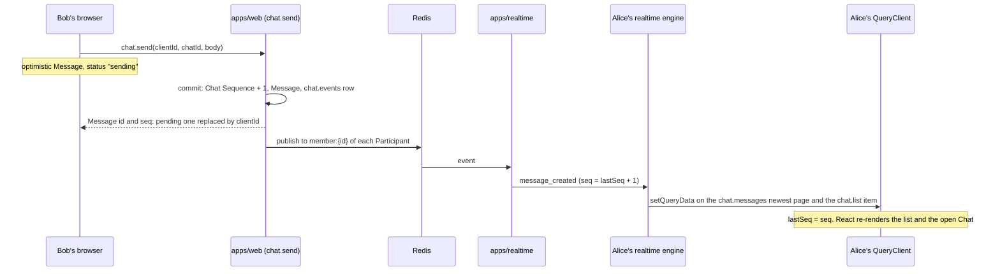
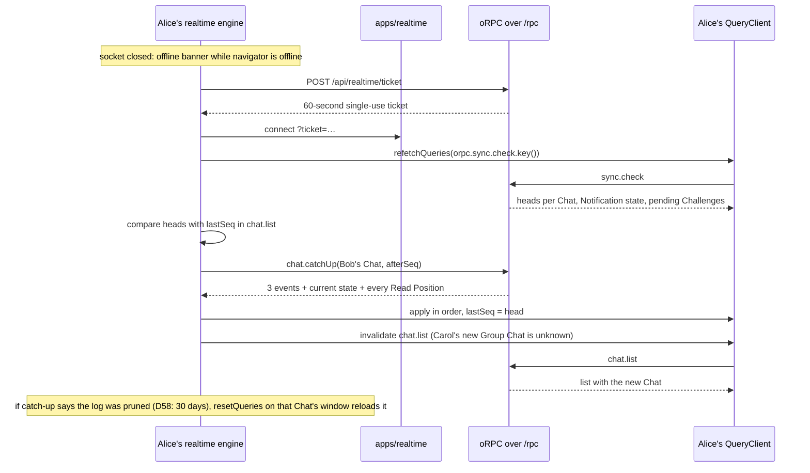

# Web data flow

Status: **current** (CHK-16). How `apps/web` loads, caches and updates server data: one set of oRPC procedures called in-process by Server Components and over HTTP by the browser (D50), handed to TanStack Query through hydration, and kept current by realtime events, catch-up and the sync check (ADR-0009, ADR-0012). CHK-19 builds the pieces named here; this doc is the pattern every screen follows.

Code below is a sketch of the shape, not copy-paste. CHK-19 wrote the real files; where they differ from the first draft of this doc, the text says so.

## Checked against

The pattern was checked against these versions on 2026-10-03, with Context7 and the npm registry (ADR-0011). CHK-19 pinned the same versions in the catalog and built on them the same day.

| Library | Version | Sources |
|---|---|---|
| oRPC (`@orpc/server`, `@orpc/client`, `@orpc/tanstack-query`) | 1.15.4 | Next.js adapter and "Optimize SSR" recipe (server-side router client on `globalThis`); TanStack Query integration (`createTanstackQueryUtils`, `.key()`, `.queryOptions()`, `.infiniteOptions()`, custom serializers); error handling (`ORPCError`, `.errors()`, `isDefinedError`); the "Next.js SSR with oRPC and TanStack Query" guide |
| TanStack Query (`@tanstack/react-query`) | 5.104.1 | Advanced Server Rendering guide (a `QueryClient` per request, `dehydrate` and `HydrationBoundary`); `hydrate` reference (existing data is only replaced by newer data); optimistic updates; `setQueryData` on infinite queries |
| Next.js | 16.3.8 | Content Security Policy guide (nonce from `proxy.ts`, every page dynamic, no partial prerendering); `connection()`; `redirect`, `notFound`, `unauthorized` (behind `experimental.authInterrupts`); `loading.tsx` |

oRPC 2 is in beta (`2.0.0-beta`); ADR-0011 stays on 1 until it is stable.

## Rules

1. **One set of procedures.** Every read and write the web app makes is an oRPC procedure. Server Components call them in-process; the browser calls them over HTTP at `/rpc`. Both go through the same middleware, so authorization has one path (D50, D9).
2. **One client shape.** `client` is a `RouterClient<typeof router>` on both sides: the server-side router client during server rendering, an `RPCLink` client in the browser. `orpc = createTanstackQueryUtils(client)` is built on top, so the same `orpc.chat.list.queryOptions()` works in both places.
3. **One `QueryClient` per request on the server, one per tab in the browser.** No Member's data can end up in another Member's HTML.
4. **One key scheme.** Query keys come only from oRPC's helpers (`.key()`, `.queryKey()`, `.infiniteKey()`). Nobody writes a key by hand.
5. **Server data lives only in TanStack Query** (ADR-0011). Realtime events, catch-up and the sync check write into the query cache; Zustand holds UI state only.
6. **Every page renders per request.** The CSP nonce (D35) makes every page dynamic: Next.js documents that static rendering, ISR and partial prerendering don't work with nonces. So there is no `"use cache"`, no Cache Components and no ISR. Pages are fast because the procedures are in-process and indexed (ADR-0007, [data model](data-model.md)).

## The pieces

| File in `apps/web` | Job |
|---|---|
| `src/server/rpc/router.ts` | The router: one namespace per module (`chat`, `feed`, `identity`, `games`, `notifications`, `moderation`, `media`), plus `sync`. Each procedure validates input with Zod, runs the auth middleware and calls the module's public entry point. Business logic stays in the modules (ADR-0003). |
| `src/server/rpc/context.ts` | Base context `{ headers }`. Middleware `withSession` reads the Better Auth session from the headers; `requireMember` (else `UNAUTHORIZED`) and `requireAdmin` (role `admin` and a passkey session, else `FORBIDDEN`, D47) build on it, and `memberProcedure` and `adminProcedure` start from them. _(CHK-20: the session is read in `src/server/session.ts`, wrapped in React `cache()` keyed by the cookie header; a banned Member's session reads as none.)_ |
| `src/server/session.ts`, `src/server/require-member-page.ts` | `getSession(headers)` for middleware and Server Components; `requireMemberPage()` redirects to `/login?next=…`, with the path from the `x-chaku-path` header `proxy.ts` sets (CHK-20). |
| `app/api/auth/[...all]/route.ts` | Better Auth's endpoints, from the identity module's `createAuth` (ADR-0004, CHK-20). |
| `app/rpc/[[...rest]]/route.ts` | `RPCHandler` for browser calls, with CSRF protection and an error interceptor that logs the procedure path and error code, never the input (D9). |
| `src/lib/orpc.server.ts` | Registers the server-side router client on `globalThis`. `instrumentation.ts` calls it once when the server starts. |
| `src/lib/orpc.ts` | Exports `client` and `orpc`. Never imports `orpc.server.ts`. |
| `instrumentation.ts` | At startup: checks the environment (Zod), registers the server-side client. Reports render and route errors through the errors adapter. |
| `proxy.ts` | The CSP nonce for each page request (D35). |
| `src/lib/query-client.ts` | `getQueryClient()`: a new client per server request, one per tab in the browser; the serializer and the defaults. |
| `app/providers.tsx` | `QueryClientProvider`, and the realtime engine started once per tab. |
| `src/realtime/` | The realtime engine: socket, reconnect, Chat Sequence checks, catch-up, the sync check loop, and pure functions that apply events to cached data. |

### The two clients

```ts
// src/lib/orpc.server.ts: instrumentation.ts calls this once; the context function runs inside each request
export function registerServerClient() {
  globalThis.$client ??= createRouterClient(router, {
    context: async () => ({ headers: await headers() }),
  })
}

// src/lib/orpc.ts
export const client: RouterClient<Router> =
  typeof window === 'undefined'
    ? lazyServerClient() // calls globalThis.$client when a procedure is called
    : createORPCClient(new RPCLink({ url: `${window.location.origin}/rpc`, plugins: [new SimpleCsrfProtectionLinkPlugin()] }))

export const orpc = createTanstackQueryUtils(client)
```

The server client is shared across requests, so its context holds nothing but the request headers, which `headers()` reads from the current request. The session comes from middleware. `getSession` is wrapped in React's `cache()`, so one server render looks it up once, however many procedures it calls. `orpc.server.ts` must not import `server-only`: oRPC's docs note it breaks the build.

_(Changed in CHK-19: the first draft followed oRPC's recipe, where `orpc.ts` runs `if (import.meta.env.SSR) await import('./orpc.server')`. Next.js 16.3 then fails the build, because client components import `orpc.ts` and their server render may not import `next/headers`. Registering from `instrumentation.ts` keeps `next/headers` out of every client graph. The server client is looked up when a procedure is called, not at import: `next build` imports pages without starting the server.)_

### The query client

```ts
// src/lib/query-client.ts
const serializer = new StandardRPCJsonSerializer() // from @orpc/client/standard; keeps Dates as Dates through dehydration

function makeQueryClient() {
  return new QueryClient({
    defaultOptions: {
      queries: {
        staleTime: 60_000, // hydrated data isn't refetched on mount
        retry: (count, error) => count < 2 && !isClientError(error), // never retry 4xx
        queryKeyHashFn: (key) => { /* oRPC serializer, as in its docs */ },
      },
      dehydrate: { serializeData: (data) => serializer.serialize(data) },
      hydrate: { deserializeData: (data) => serializer.deserialize(data) },
    },
  })
}
```

`getQueryClient()` returns a new client on the server (`environmentManager.isServer()`) and one cached client in the browser, as TanStack's Advanced Server Rendering guide shows.

**Freshness:**
- Queries the realtime engine keeps current have `staleTime: Infinity`: the chat list, Message windows, a Chat's details and Read Positions, and the sync check result. They change only through events, catch-up, the sync check or an explicit invalidation.
- Everything else keeps the 60-second default: feed lists, profiles, settings.

## Query keys

oRPC builds each key from the procedure path, the input and the kind (`query` or `infinite`). TanStack matches keys by prefix and partial input, so invalidating by `orpc.chat.key()` hits every `chat` query, and `orpc.chat.messages.key({ input: { chatId } })` hits every window of one Chat.

| Data | Procedure | Kind | Kept current by |
|---|---|---|---|
| Chat list, with each Chat's `lastSeq`, Unread count and last Message | `chat.list` | query | realtime events, sync check |
| One Chat: name, avatar, Participants, every Participant's Read Position | `chat.get({ chatId })` | query | realtime events, catch-up |
| Messages of one Chat | `chat.messages({ chatId, cursor })` | infinite, both directions, `maxPages` keeps about 200 Messages (ADR-0011) | realtime events, catch-up |
| Sync check | `sync.check` | query, polled | itself (below) |
| Notifications, unread count | `notifications.list`, `notifications.unreadCount` | infinite, query | invalidated by the sync check |
| Pending Game Challenges | `games.pendingChallenges` | query | realtime events, sync check |
| Feed lists (Hot, New, Top), a Post, its Comments | `feed.posts`, `feed.post`, `feed.comments` | infinite, query, infinite | 60 s staleness; live Comments by events |
| Profiles for names and avatars | `identity.profiles({ ids })` | query | 60 s staleness |

Feed screens follow the same pattern as the chat list. Only the Chat screens are worked through below, because they are the ones realtime updates.

The Chat Sequence lives in the cache too: each chat list item carries `lastSeq`, the last number this tab has applied for that Chat. The realtime engine reads and writes it there. There is no second store.

## First load from a Server Component

A layout or page:
1. checks the session
2. creates a request `QueryClient`
3. prefetches the data the first screen shows, through the in-process client
4. passes the dehydrated cache to a client component inside a `HydrationBoundary`

```tsx
// app/(app)/chats/layout.tsx
export default async function ChatsLayout({ children }: { children: React.ReactNode }) {
  await requireMemberPage() // redirect('/login?next=…') without a session
  const queryClient = getQueryClient()
  await queryClient.query(orpc.chat.list.queryOptions({ input: {} })).catch(noop)
  return (
    <HydrationBoundary state={dehydrate(queryClient)}>
      <ChatList />
      {children}
    </HydrationBoundary>
  )
}

// components/chat-list.tsx
'use client'
export function ChatList() {
  const { data } = useSuspenseQuery(orpc.chat.list.queryOptions({ input: {} }))
  // …
}
```

- **Await what the first screen shows; leave the rest to the client.** Prefetching the window around the first unread Message is worth it. Profiles of people further up the history are not. Pending queries are not streamed in v1; that keeps errors simple. Measure in phase 2 before changing it.
- **The page's main item uses `query()`, extras use `query().catch(noop)`.** `query()` throws, so a missing or forbidden Chat becomes `notFound()` on the server. An extra swallows its error, and the client component retries and shows its error boundary. _(Changed in CHK-19: TanStack Query 5.104 deprecates `fetchQuery` and `prefetchQuery` in favour of `query()`.)_
- **A Server Component may call `client` directly** when the result is rendered on the server and never needed in the cache, for example `generateMetadata` on the public Post page. It is the same procedure and the same authorization.

## Realtime events into the cache

The realtime engine (`src/realtime/`) runs once per tab, outside React, with the `QueryClient` in hand. Event payload shapes are the realtime protocol doc's job. This doc assumes each event carries the Chat ID, its Chat Sequence number (except `read_position`) and the current state of what it references, the same shape catch-up returns. Applying an event then needs no request.

For each Chat event:

1. Read `lastSeq` for the Chat from the chat list cache.
2. `seq <= lastSeq`: already applied. Drop it.
3. `seq = lastSeq + 1`: apply it with `setQueryData` to every cached query it touches (below), then set `lastSeq = seq`.
4. `seq > lastSeq + 1`: a gap. Hold this event, call `chat.catchUp({ chatId, afterSeq: lastSeq })`, apply the result in order, then the held events that are still newer.
5. A Chat missing from the chat list: invalidate `chat.list` (the sync check would find it anyway).

| Event | Cache updates |
|---|---|
| `message_created` | the Chat's newest page of `chat.messages`, if that page is cached; the chat list item: last Message, Unread count unless I wrote it, moved to the top |
| `message_edited`, `message_deleted`, `message_removed`, `message_images_ready`, `reaction_added`, `reaction_removed` | the Message in whichever cached page holds it, matched by ID |
| `participant_*`, `chat_renamed`, `chat_avatar_changed` | `chat.get`, and the chat list item |
| `read_position` (no Chat Sequence number, D49) | the Participant's Read Position in `chat.get`, only if it moves forward |

The apply functions are pure: `(cachedData, event) → cachedData`. That lets a property test with `fast-check` show that any order of events plus catch-up gives the same result as applying them in order.

## Sending, with optimistic updates

A send is a mutation with a `clientId`, a fresh UUID made in the browser:

1. **`onMutate`:** add the Message to the newest page as `sending`, keyed by `clientId`, and move the Chat to the top of the list.
2. **Success:** the response has the Message's `id` and `seq`, and replaces the pending one by `clientId`.
3. **The echo:** the sender's own `message_created` event carries the `clientId` too. Whichever arrives first replaces the pending Message, and the other one finds nothing left to do.
4. **Failure:** the Message stays, marked failed with "Retry". Retrying sends the same `clientId`, so the server never creates it twice (§5.3, `messages_author_client_key`). A 4xx (`RATE_LIMITED`, a Block) shows the reason and isn't retried automatically.

There is no offline sending (D7): the composer is disabled while offline, and the offline banner shows. Mutations use `networkMode: 'always'`, so nothing waits in a hidden queue.

Edits, deletes, Reactions and Read Positions also update optimistically and roll back on error. Read Positions are debounced, only move forward, and are never rolled back.

## The sync check loop

`sync.check` is a polled query (ADR-0012):

```ts
useQuery({
  ...orpc.sync.check.queryOptions(),
  staleTime: Infinity,
  refetchInterval: 60_000,             // every 60 s…
  refetchIntervalInBackground: false,  // …only while the page is visible
  refetchOnWindowFocus: 'always',      // TanStack's focus manager listens to visibilitychange
})
// and the realtime engine calls refetchQueries on orpc.sync.check.key() after every (re)connect
```

The engine compares each result with the cache:

| Finding | Action |
|---|---|
| A Chat's head is above its `lastSeq` | catch-up for that Chat |
| A Chat the list doesn't have | invalidate `chat.list` |
| A listed Chat missing from the result | remove it from `chat.list`, and remove its `chat.get` and `chat.messages` queries |
| Newest Notification ID or unread count changed | invalidate `notifications.*` |
| Pending Game Challenges changed | replace `games.pendingChallenges` |

## Errors, auth failures and loading

**Error codes.** Procedures declare typed errors with `.errors()`, and the client narrows them with `isDefinedError`:

| Code | When | In the browser |
|---|---|---|
| `UNAUTHORIZED` | no session, or it was revoked | a global `QueryCache` and `MutationCache` `onError` sends the tab to the login page with a full navigation. The socket closes too (ADR-0009) |
| `NOT_FOUND` | the item doesn't exist **or the viewer may not see it**. One answer for both, so probing can't reveal a Chat (D9) | the screen's "not found" state |
| `FORBIDDEN` | visible but not allowed: sending to a Member who blocked you (D11), Admin tools without a passkey session (D47) | the reason, in EN and UK through next-intl |
| `RATE_LIMITED` | a limit from D56; `data.retryAfter` in seconds | a toast with the wait |
| `BAD_REQUEST` | Zod validation | the field's message (forms) |
| anything else | a bug | the error boundary; reported to Sentry without input (D9) |

**On the server.** The signed-in layout checks the session itself and calls `redirect('/login?next=…')`. `unauthorized()` would fit, but it still needs `experimental.authInterrupts`, and we don't depend on experimental flags. A `NOT_FOUND` from `query()` becomes `notFound()`.

**Loading.** Each route segment that waits for data has a `loading.tsx`, so navigation shows a skeleton at once. Client components use `useSuspenseQuery` under Suspense boundaries; data hydrated from the server never suspends. Realtime updates never show spinners.

## Worked example: the chat list and an open Chat

Alice opens Chaku on `/chats/{chatId}`, opens another Chat, receives a Message from Bob, then her laptop sleeps and wakes up.

### First load

The full page request: the proxy sets the nonce, the layout prefetches the chat list, the page fetches the Chat and the window around the first unread Message, and the HTML arrives with the dehydrated cache. The realtime engine then connects and runs a sync check, which finds nothing new.



### Client navigation

Alice taps another Chat. The layout and the chat list stay mounted. Next.js shows the segment's `loading.tsx` and requests only the page segment, whose Server Component prefetches the new window in-process. `HydrationBoundary` adds it to the cache. If a newer copy is already cached, from an earlier visit kept current by events, `hydrate` keeps the newer copy.



### A realtime event

Bob sends a Message. Alice's tab gets `message_created` with the next Chat Sequence number. It updates the cached window, if that Chat's window is cached, and the chat list.



If the number were `lastSeq + 2`, the engine would hold the event and run catch-up first, as in the next example.

### Reconnecting

Alice's laptop sleeps. Bob sends two Messages and edits an older one, and Carol adds Alice to a new Group Chat. On wake, the socket reconnects and the sync check finds the gaps.



## Left to other docs

- Event payloads, catch-up limits, and Presence and typing over the socket: the realtime protocol doc (before phase 2).
- Which procedure each screen calls, and its input: decided in each feature's ticket, inside the key scheme above.
- Push and the service worker cache (`@serwist/turbopack`): the PWA ticket. The service worker never caches `/rpc` responses.
