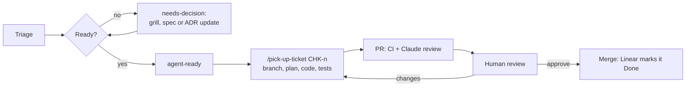

# Workflow

Chaku is built by one person with coding agents. Linear holds the work, the repo holds the truth, and CI is the gate. This page describes how a piece of work moves from an idea to merged code.

## Where things live

| Thing | Home |
|---|---|
| Product decisions, architecture, guides | this repo (`docs/`, `CONTEXT.md`) |
| Epics, tickets, bugs, triage, roadmap | Linear, team **CHK** |
| Code review and CI | GitHub pull requests |
| Errors and product analytics | Sentry and PostHog, both linked to Linear |

## Linear structure

- **Initiative:** v1 Friends Beta
- **Projects:** one per build phase in spec §6:
  1. Foundation
  2. Realtime & Direct Chat
  3. Group Chat & Notifications
  4. Wave 1 Readiness
  5. Games Platform
  6. Feed
  7. Beta Hardening

  Plus two ongoing projects: **Design System** and **Dev Workflow**.
- **Milestones:** Wave 1 (end of phase 4), Wave 2 (phase 5), Wave 3 (phase 6).
- **Workflow states:** Triage → Backlog → Todo → In Progress → In Review → Done, plus Canceled and Duplicate.
- **Labels:**
  - **Type** group, exactly one: `Feature`, `Bug`, `Improvement`, `Chore`, `Spike`, `Docs`
  - **Area**, any number (plain labels, because this Linear plan has no multi-select groups): `identity`, `chat`, `feed`, `games`, `results`, `notifications`, `moderation`, `search`, `web`, `realtime`, `worker`, `ui`, `infra`
  - **Flow:** `agent-ready`, `needs-decision`, `blocked`, and `you` (needs a human: accounts, payments, legal, brand or product calls; agents never pick these up)
- **Integrations:** GitHub (branch names, PR links, auto-close on merge), Sentry (create issues from errors), the in-app feedback button (creates Triage issues, D19).

## Ticket template

```markdown
## Why
One or two sentences. Link the spec decision (Dn) or ADR.

## What
The change, in CONTEXT.md terms.

## Acceptance criteria
- [ ] Each one observable and testable. Each becomes at least one test.

## Notes
Modules touched, open questions, links to designs.
```

## Definition of Ready (`agent-ready`)

A ticket gets `agent-ready` only when:
- the acceptance criteria are written and testable
- it links the spec decisions or ADRs it implements
- it names the modules it touches
- it needs no product decision (otherwise label it `needs-decision`) and no human-only step (otherwise `you`)
- it fits in one PR

## The loop



1. **Pick up.** `/pick-up-ticket CHK-123` in Claude Code reads the ticket and its linked docs, moves it to In Progress, creates the branch, plans, implements, tests and opens the PR.
2. **Branch:** `chk-123-short-title`. **PR title:** `CHK-123: Short title`. Linear links them automatically.
3. **CI** must pass: lint, type check, dependency-cruiser boundaries, unit and module tests, end-to-end tests for touched flows, `gitleaks`. Add the `preview` label for a PR preview.
4. **Review.** A Claude review runs on every PR. You review and merge.
5. **Docs in the same PR.** If the change alters a decision, the spec or an ADR changes in the same PR.

## Commits

Conventional Commits (`feat(chat): …`, `fix(identity): …`, `docs(adr): …`), with the Linear ID in the PR title. Squash merge into `main`.

## Agent tools

| Tool | Used for |
|---|---|
| Linear MCP | reading and updating tickets |
| Context7 MCP | current library docs (versions are newer than model training data) |
| Figma MCP | design system and screens |
| Playwright MCP / built-in browser | driving the running app |
| `gh` CLI | GitHub: PRs, checks, releases |
| Postgres MCP (Foundation) | **local database only** (D9) |
| Sentry, PostHog, Railway MCPs | added when those accounts exist |

Project skills in `.claude/skills/`: `pick-up-ticket` and `new-adr`. Foundation adds `new-module` and `new-migration`. The user-level skills `triage`, `grill-with-docs` and `improve-codebase-architecture` fit this loop too.
